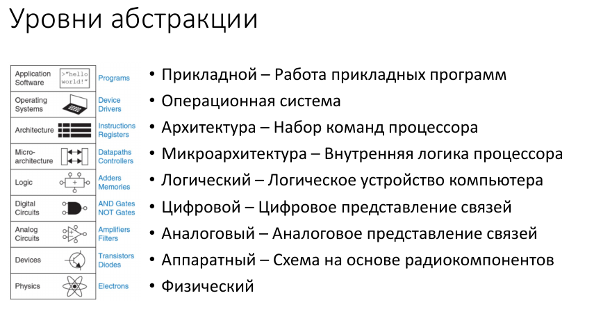

# **Билет: Многоуровневая организация ЭВМ**

### **1. Понятие многоуровневой организации ЭВМ**

Многоуровневая организация ЭВМ – это архитектурный подход, при котором компьютерная система представляется в виде иерархии уровней абстракции. Каждый уровень выполняет определенные функции, предоставляя интерфейс для вышележащего уровня и используя возможности нижележащего.

### **2. Основные уровни организации ЭВМ**

Традиционно выделяют следующие уровни (снизу вверх):

1. Аппаратный уровень – электронные компоненты, схемы, сигналы.
2. **Микропрограммный уровень** – управление аппаратурой с помощью микрокоманд.
3. **Уровень архитектуры набора команд (ISA)** – машинные инструкции, выполняемые процессором.
4. **Уровень операционной системы** – управление ресурсами, виртуализация.
5. **Уровень ассемблера** – низкоуровневое программирование.
6. **Уровень языков высокого уровня** – программы на C++, Python и др.
7. **Уровень прикладных программ** – пользовательские приложения.

### **3. Принципы взаимодействия уровней**

* Каждый уровень скрывает детали реализации от вышестоящих.
* Переход между уровнями происходит через четко определенные интерфейсы.
* Изменения на одном уровне минимально влияют на другие.

### **4. Преимущества многоуровневой организации**

* Упрощение проектирования и модификации.
* Повышение переносимости программного обеспечения.
* Возможность независимой оптимизации каждого уровня.

### **5. Заключение**

Многоуровневая организация ЭВМ – ключевой принцип компьютерной архитектуры, обеспечивающий гибкость, масштабируемость и эффективность вычислительных систем.

## Подробное описание уровней многоуровневой организации ЭВМ

Многоуровневая архитектура компьютера позволяет разделить сложную систему на иерархические слои, каждый из которых выполняет свою функцию, абстрагируясь от деталей нижележащих уровней. Рассмотрим каждый уровень подробно.

## **1. Физический (аппаратный) уровень**

**Описание:**
Это самый низкий уровень, включающий электронные компоненты, схемы и физические процессы:

* Транзисторы, резисторы, конденсаторы.
* Логические элементы (AND, OR, NOT).
* Аналоговые и цифровые сигналы.
* Шины данных, тактовые генераторы.

**Функции:**

* Преобразование электрических сигналов в двоичные данные (0 и 1).
* Выполнение элементарных логических и арифметических операций.
* Обеспечение синхронизации (тактовые импульсы).

## **2. Микропрограммный уровень (микрокод)**

**Описание:**
Микропрограммное управление – это промежуточный слой между аппаратурой и машинными командами.

Состоит из **микрокоманд** – простейших инструкций, управляющих аппаратными блоками.

**Функции:**

* Интерпретация машинных команд в последовательность микрокоманд.
* Управление конвейером процессора, кэшем, предсказанием ветвлений.
* Исправление ошибок через обновление микрокода.

**Пример:**

* В процессорах Intel микрокод преобразует сложные x86-команды в RISC-подобные микрооперации.

## **3. Уровень архитектуры набора команд (ISA – Instruction Set Architecture)**

**Описание:**
Это интерфейс между программным обеспечением и процессором. Включает:

* Набор машинных инструкций (ADD, MOV, JMP).
* Регистры общего назначения.
* Режимы адресации.
* Систему прерываний.

**Функции:**

* Определяет, какие команды процессор может выполнять.
* Обеспечивает совместимость ПО для процессоров одной архитектуры.

**Примеры ISA:**

* **x86** (Intel, AMD) – сложные команды (CISC).
* **ARM** – энергоэффективные RISC-команды.
* **RISC-V** – открытая архитектура.

## **4. Уровень операционной системы (ОС)**

**Описание:**
ОС управляет ресурсами компьютера и предоставляет интерфейсы для программ. Основные функции:

* **Управление памятью** (виртуальная память, страничная организация).
* **Планирование задач** (многозадачность, потоки).
* **Файловая система** (организация хранения данных).
* **Драйверы устройств** (взаимодействие с железом).

**Примеры:**

* Windows, Linux, macOS – абстрагируют приложения от конкретного железа.
* Гипервизоры (VMware, Hyper-V) – виртуализируют аппаратные ресурсы.

## **5. Уровень ассемблера**

**Описание:**
Язык ассемблера – это символическое представление машинного кода:

* Команды типа `MOV AX, 5` соответствуют двоичным инструкциям ISA.
* Требует ассемблера для преобразования в машинный код.

**Функции:**

* Оптимизация критичных участков кода.
* Написание драйверов, прошивок, низкоуровневых системных программ.

## **6. Уровень языков высокого уровня (ЯВУ)**

**Описание:**
Языки, близкие к человеческому мышлению:

* **C/C++** – системное программирование.
* **Python, Java** – кроссплатформенные приложения.
* **JavaScript** – веб-разработка.

**Функции:**

* Абстрагирование от аппаратуры (переносимость).
* Упрощение разработки через библиотеки и фреймворки.

**Пример:**

* Одна и та же программа на Python может работать на Windows и Linux без изменений.

## **7. Уровень прикладных программ**

**Описание:**
Программы, с которыми взаимодействует пользователь:

* Офисные приложения (Word, Excel).
* Браузеры (Chrome, Firefox).
* Игры, графические редакторы.

**Функции:**

* Решение конкретных задач пользователя.
* Использование API ОС и библиотек ЯВУ.

---

### **Вывод**

Каждый уровень многоуровневой организации ЭВМ решает свои задачи, обеспечивая модульность, переносимость и масштабируемость системы. Изменения на одном уровне (например, замена процессора) могут не затрагивать другие
