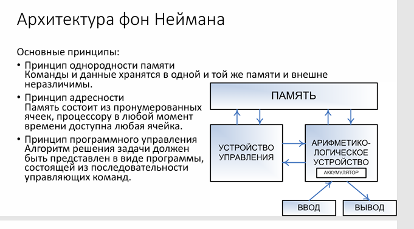

# Архитектура фон Неймана. Её модификации: кэширование, виртуальная память, конвейер, параллельное аппаратное обеспечение.

Архитектура фон Неймана (1945) — классическая модель построения ЭВМ, лежащая в основе большинства современных компьютеров.

## **1. Основные принципы архитектуры фон Неймана**

1. **Однородность памяти (принцип хранимой программы)**
   * Программы и данные хранятся в одной памяти.
   * Команды могут обрабатываться как данные (например, при компиляции).
2. **Последовательное выполнение команд**
   * Процессор выполняет команды одну за другой (если нет переходов).
3. **Структура из пяти основных компонентов:**
   * **Арифметико-логическое устройство (АЛУ)** – выполняет вычисления.
   * **Устройство управления (УУ)** – интерпретирует команды.
   * **Память** – хранит данные и команды.
   * **Устройства ввода/вывода** – взаимодействие с внешним миром.
   * **Шина (канал передачи данных)** – связывает компоненты.

**Недостатки классической модели:**

* **"Узкое место" фон Неймана** – пропускная способность между CPU и памятью ограничена.
* **Последовательное выполнение** – низкая производительность.

## **2. Модификации архитектуры фон Неймана**

### **(1) Кэширование (Cache Memory)**

**Проблема**

* "Узкое место фон Неймана": процессор работает на частотах в несколько ГГц, а доступ к оперативной памяти (RAM) занимает сотни тактов.
* **Пример**: если CPU ждёт данные из RAM, он простаивает, снижая общую производительность.

**Решение: иерархия кэш-памяти**

Кэш — это сверхбыстрая память, хранящая копии часто используемых данных. Уровни:

* **L1 (Level 1)**
  * Находится прямо в ядре процессора.
  * Разделён на **кэш инструкций** (L1i) и **кэш данных** (L1d).
  * Задержка: **1-3 такта**, размер: **32-64 КБ на ядро**.
* **L2 (Level 2)**
  * Также расположен в ядре (или общий для нескольких ядер).
  * Задержка: **10-20 тактов**, размер: **256 КБ – 1 МБ**.
* **L3 (Level 3)**
  * Общий для всех ядер процессора.
  * Задержка: **30-50 тактов**, размер: **2-64 МБ** (в серверных CPU до 256 МБ).

**Принципы работы**

* **Локализация обращений**:
  * **Временная** (если данные использовались недавно, они остаются в кэше).
  * **Пространственная** (кэш загружает не только запрошенный байт, но и соседние).
* **Политики замещения** (когда кэш заполнен):
  * **LRU (Least Recently Used)** – заменяется реже всего используемая строка.
  * **FIFO (First In, First Out)** – по порядку загрузки.

**Пример из реального процессора**

* **Intel Core i9-13900K**:
  * L1: 80 КБ (32 КБ данных + 48 КБ инструкций) на ядро.
  * L2: 2 МБ на ядро (в Performance-cores).
  * L3: 36 МБ общий.

### **(2) Виртуальная память**

**Проблема**

* Физическая память (RAM) ограничена (например, 16 ГБ), но программам может требоваться больше (например, 32 ГБ для видеомонтажа).
* Без виртуальной памяти приложения могли бы "отбирать" память друг у друга, приводя к крахам.

**Решение: механизм подкачки (paging)**

1. **Виртуальные адреса**
   * Каждая программа работает в своём виртуальном адресном пространстве.
   * Адреса транслируются в физические через таблицу страниц (Page Table).
2. **Страницы (pages)**
   * Память делится на блоки (обычно **4 КБ**, в современных CPU — **2 МБ или 1 ГБ** при "huge pages").
3. **Файл подкачки (swap)**
   * Если RAM переполнена, часть страниц сохраняется на SSD/HDD.

**Ключевые компоненты**

* **MMU (Memory Management Unit)** – аппаратный блок в CPU, отвечающий за трансляцию адресов.
* **TLB (Translation Lookaside Buffer)** – кэш для быстрого доступа к таблице страниц.

**Эффект:**

* Программы могут использовать больше памяти, чем есть физически.
* Изоляция процессов (один процесс не может повредить память другого).

**Примеры**

* **Windows**: файл `pagefile.sys`.
* **Linux**: раздел подкачки (`/swap`).

**Проблема:** Физическая память (RAM) ограничена, но программам нужно больше.

### **(3) Конвейеризация (Pipeline)**

**Проблема:** В классической модели фон Неймана процессор выполняет одну команду за раз, что неэффективно.

**Решение:**

* Разбиение выполнения команды на этапы (выборка, декодирование, выполнение, запись).
* Каждый этап обрабатывает свою команду одновременно.

**Эффект:**

* Увеличение пропускной способности (например, 5-ступенчатый конвейер у Intel Pentium).
* **Проблемы:** Опасности (hazards) – конфликты из-за зависимостей команд.

**Пример:**

* Современные процессоры (ARM Cortex, Intel Core) используют **суперскалярные конвейеры** (несколько команд в параллель).

### **(4) Параллельное аппаратное обеспечение**

**Проблема:** Увеличение тактовой частоты упёрлось в физические ограничения (тепловыделение, квантовые эффекты).

**Решение:**

#### **a) Многоядерные процессоры**

* Несколько ядер в одном кристалле (например, 16 ядер у AMD Ryzen 9).
* Параллельное выполнение потоков (multithreading).

#### **b) SIMD (Single Instruction, Multiple Data)**

* Одна команда обрабатывает несколько данных (например, SSE, AVX в x86).
* Используется в графике, машинном обучении.

#### **c) Гетерогенные вычисления**

* Гетерогенные вычисления — это подход, при котором система использует **разные типы процессоров** (CPU, GPU, FPGA, TPU и др.) для оптимального выполнения задач. В отличие от классических однородных систем (только CPU), гетерогенные архитектуры комбинируют специализированные ускорители, что позволяет достичь высокой эффективности в специфичныхСочетание CPU, GPU, TPU для разных задач.
* Пример: Apple M1 (CPU + GPU + Neural Engine).

**Эффект:**

* Существенный прирост производительности в многопоточных задачах.

## **3. Вывод**

Эти модификации превратили классическую архитектуру фон Неймана в высокопроизводительные современные системы:

* **Кэш** ускоряет доступ к памяти.
* **Виртуальная память** изолирует процессы и экономит RAM.
* **Конвейер** увеличивает инструкционную пропускную способность.
* **Параллелизм** (многоядерность, SIMD) даёт экспоненциальный рост производительности.
