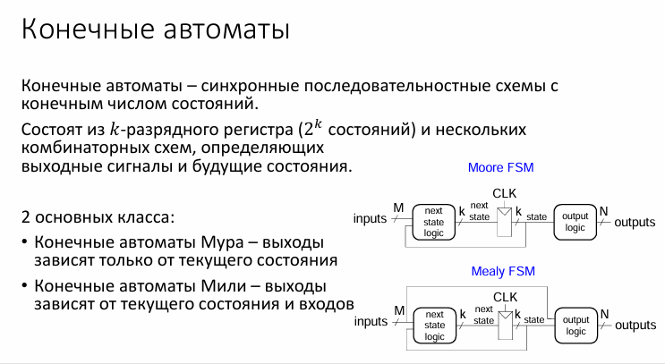
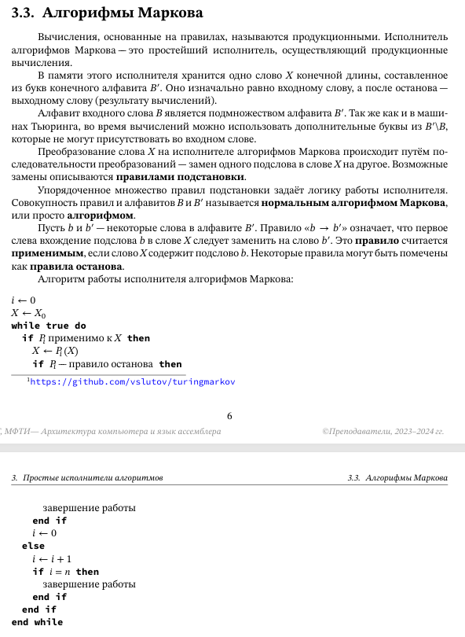

# Простейшие исполнители: конечные автоматы, машины Тьюринга, алгорифмы Маркова.

### **Конечные автоматы (Finite State Machines, FSM)**

#### **1. Определение и основные понятия**

**Конечный автомат (Finite State Machine, FSM)** — это математическая модель вычислений, состоящая из конечного числа состояний и переходов между ними. Автомат обрабатывает входную строку символ за символом, изменяя своё состояние в зависимости от текущего символа и правил переходов.

**Основные компоненты:**

* **Q** — конечное множество состояний (например, `{q0, q1, q2}`).
* **Σ (сигма)** — входной алфавит (допустимые символы, например, `{0, 1}`).
* **δ (дельта)** — функция переходов: `δ: Q × Σ → Q` (для недетерминированных автоматов `δ: Q × Σ → P(Q)`, где `P(Q)` — множество подмножеств Q).
* **q₀ ∈ Q** — начальное состояние.
* **F ⊆ Q** — множество конечных (допускающих) состояний.

#### **2. Типы конечных автоматов**

##### **(a) Детерминированный конечный автомат (DFA)**

* Для каждого состояния и символа существует **ровно один переход**.
* Формально: `δ(q, a) = q'`, где `q, q' ∈ Q`, `a ∈ Σ`.

**Пример DFA:**
Автомат, распознающий строки с чётным числом '1':

* Состояния: `q0` (чётное '1'), `q1` (нечётное '1').
* Переходы:
  * `δ(q0, 0) = q0`, `δ(q0, 1) = q1`,
  * `δ(q1, 0) = q1`, `δ(q1, 1) = q0`.
* Конечное состояние: `F = {q0}`.

##### **(b) Недетерминированный конечный автомат (NFA)**

* Для некоторых состояний и символов возможны **несколько переходов** или **отсутствие переходов**.
* Формально: `δ(q, a) = {q₁, q₂, ...}`.

**Пример NFA:**
Автомат, распознающий строки, оканчивающиеся на '01':

* Состояния: `q0`, `q1`, `q2`.
* Переходы:
  * `δ(q0, 0) = {q0, q1}`, `δ(q0, 1) = {q0}`,
  * `δ(q1, 1) = {q2}`.
* Конечное состояние: `F = {q2}`.

**Эквивалентность DFA и NFA:**
Любой NFA можно преобразовать в DFA (методом подмножеств), но DFA может иметь экспоненциально больше состояний.

#### **3. Диаграммы состояний (State Diagrams)**

Конечные автоматы удобно визуализировать в виде графов:

* **Узлы** — состояния.
* **Рёбра** — переходы (помечены символами).
* **Двойной круг** — конечное состояние.

**Пример для DFA (чётное число '1'):**

```
       0
   ┌───────┐
   ▼       │
┌───┐  1  ┌───┐
│q0 │────▶│q1 │
└───┘     └───┘
  ▲         │
  └─────────┘
       1
```

#### **4. Применение конечных автоматов**

1. **Лексический анализ** (токенизация в компиляторах):
   * Регулярные выражения преобразуются в NFA/DFA.
   * Пример: распознавание идентификаторов (`[a-zA-Z_][a-zA-Z0-9_]*`).
2. **Протоколы связи** (сетевые автоматы):
   * Проверка корректности пакетов (например, автомат для TCP-соединения).
3. **Управляющие системы** (электронные устройства):
   * Автомат для управления лифтом, светофором.
4. **Биоинформатика**:
   * Поиск шаблонов в ДНК-последовательностях.

#### **5. Ограничения конечных автоматов**

* **Не могут распознать контекстно-свободные языки** (например, `{aⁿbⁿ | n ≥ 0}`).
* **Нет памяти, кроме текущего состояния** (в отличие от стека в PDA или ленты в машине Тьюринга).





---

### **2. Машина Тьюринга (Turing Machine, TM)**

#### **1. Определение и основные понятия**

**Машина Тьюринга** — это абстрактная вычислительная модель, предложенная Аланом Тьюрингом в 1936 году. Она формализует понятие алгоритма и является фундаментом теории вычислимости.

**Ключевые особенности:**

* Бесконечная **лента**, разделённая на ячейки.
* **Головка**, которая может читать, записывать символы и перемещаться влево/вправо.
* **Конечное управляющее устройство** (набор состояний).

**Формальное определение:**
Машина Тьюринга — это кортеж из 7 элементов:

```
M = (Q, Σ, Γ, δ, q₀, q_accept, q_reject)
```

* **Q** — конечное множество состояний.
* **Σ** — входной алфавит (символы, которые могут быть на ленте).
* **Γ** — алфавит ленты (Σ ⊆ Γ, включает пустой символ `␢`).
* **δ: Q × Γ → Q × Γ × {L, R}** — функция переходов.
* **q₀ ∈ Q** — начальное состояние.
* **q\_accept ∈ Q** — состояние принятия.
* **q\_reject ∈ Q** — состояние отвержения (q\_accept ≠ q\_reject).

#### **2. Принцип работы**

1. **Инициализация:**
   * На ленту записывается входная строка (остальные ячейки содержат `␢`).
   * Головка устанавливается на первый символ строки.
   * Управляющее устройство переходит в состояние `q₀`.
2. **Шаг вычисления:**
   * Машина читает символ под головкой.
   * Согласно функции `δ`, она:
     * Меняет состояние.
     * Записывает новый символ в текущую ячейку.
     * Перемещает головку влево (`L`) или вправо (`R`).
3. **Завершение:**
   * Если достигается `q_accept` — вход принимается.
   * Если `q_reject` — отвергается.
   * Если переход не определён — машина «зависает» (не останавливается).

#### **3. Примеры машин Тьюринга**

##### **(a) Инвертирование битов**

**Язык:** Все строки из `{0, 1}*`.
**Правила:**

* `δ(q0, 0) = (q0, 1, R)`
* `δ(q0, 1) = (q0, 0, R)`
* `δ(q0, ␢) = (q_accept, ␢, R)`

**Работа на входе `101`:**

```
Шаг 0: [1]01 → q0  
Шаг 1: 0[0]1 → q0 (записывает 1)  
Шаг 2: 01[1] → q0 (записывает 0)  
Шаг 3: 010[␢] → q_accept  
Результат: `010`  
```

#### **4. Вариации машин Тьюринга**

##### **(a) Многоленточная машина Тьюринга**

* Имеет **несколько лент** (обычно k ≥ 1).
* Головки работают независимо.
* **Теорема:** Любая k-ленточная МТ эмулируется одноленточной с квадратичным замедлением.

##### **(b) Недетерминированная машина Тьюринга**

* Функция `δ` возвращает **множество вариантов** переходов.
* **Теорема:** Для любой недетерминированной МТ существует эквивалентная детерминированная МТ.

##### **(c) Машина с полубесконечной лентой**

* Лента бесконечна только в одну сторону.
* **Эквивалентность:** Может имитировать стандартную МТ.

#### **5. Вычислительная мощность**

* **Тезис Чёрча-Тьюринга:**
  > Любая алгоритмически вычисляемая функция может быть вычислена машиной Тьюринга.
  >
* **Универсальная машина Тьюринга:**
  Может имитировать любую другую МТ по её описанию (аналог современного компьютера).

#### **6. Применение**

1. **Теория вычислимости:**
   * Доказательство разрешимости/неразрешимости задач (например, проблема остановки).
2. **Сложность вычислений:**
   * Классы P, NP определяются через МТ.
3. **Криптография:**
   * Анализ стойкости алгоритмов.

#### **7. Ограничения**

* **Неразрешимые проблемы:**
  * Проблема остановки (нельзя определить, остановится ли произвольная МТ на данном входе).
* **Практическая неэффективность:**
  * МТ — теоретическая модель, не учитывающая время (в отличие, например, от RAM-машин).


---------------------------------------------------------------------------------------

### **3. Алгорифмы Маркова (Normal Markov Algorithms)**

#### **1. Определение и основные понятия**

**Алгорифм Маркова** — это формальная система переработки слов в некотором алфавите, основанная на последовательном применении **подстановочных правил**. Предложена советским математиком **А.А. Марковым** в 1951 году.

**Ключевые особенности:**

* Работает со **строками символов** (а не с лентами или состояниями, как машина Тьюринга).
* Использует **набор правил подстановки**, применяемых в строгом порядке.
* Эквивалентна по мощности **машине Тьюринга** (может решать те же задачи).

**Формальное определение:**
Алгорифм Маркова задаётся:

* **Алфавит** A**A** (конечное множество символов).
* **Схемой подстановок** (правила вида α→β**α**→**β**, где α,β**α**,**β** — слова в алфавите A∪{∅}**A**∪**{**∅**}**).
* **Типы правил**:
  * **Обычные**: α→β**α**→**β** (применяются, пока возможно).
  * **Терминальные**: α→⋅β**α**→**⋅**β (после применения алгоритм останавливается).

#### **2. Принцип работы**

1. **Исходное слово**: На вход подаётся строка w**w**.
2. **Просмотр правил**: Правила проверяются **по порядку** их записи.
3. **Применение правила**:
   * Находится **первое вхождение** левой части α**α** текущего правила в строку.
   * Если вхождение найдено, α**α** заменяется на β**β**.
   * Если правило **терминальное**, алгоритм завершается.
4. **Повтор**: Процесс повторяется для новой строки, пока не применится терминальное правило или не будут исчерпаны все возможности.

**Важно:**

* Если ни одно правило не применимо — алгоритм завершается без изменения строки.
* Порядок правил **критичен** (разные порядки могут давать разные результаты).

#### **3. Примеры алгорифмов Маркова**

##### **(a) Инвертирование битов**

**Алфавит:** {0,1}**{**0**,**1**}**.
**Правила:**

1. 0→1**0**→**1**
2. 1→0**1**→**0**
3. ∅→⋅∅**∅**→**⋅**∅ (пустое слово для остановки).

**Работа на входе "101":**

* Шаг 1: 101→111**1**0**1**→**1**1**1** (применяется правило 1).
* Шаг 2: 111→011**1**11**→**0**11** (правило 2).
* Шаг 3: 011→001**0**1**1**→**0**0**1** (правило 2).
* Шаг 4: 001→000**00**1**→**00**0** (правило 2).
* Результат: 000**000**.

##### **(b) Удаление всех букв "a"**

**Алфавит:** {a,b,c}**{**a**,**b**,**c**}**.
**Правила:**

1. a→∅**a**→**∅** (удаление).
2. ∅→⋅∅**∅**→**⋅**∅.

**Работа на входе "aabacba":**

* Результат: bcb**b**c**b**.

#### **4. Вычислительная мощность**

* **Теорема Маркова-Поста:**
  > Класс функций, вычислимых нормальными алгорифмами, совпадает с классом функций, вычислимых машиной Тьюринга.
  >
* **Следствие:**
  * Алгорифмы Маркова могут решать **любые алгоритмически разрешимые задачи**.
  * Пример: арифметические операции, проверка палиндромов, алгоритмы сортировки.

#### **5. Сравнение с другими моделями**

**Преимущества алгорифмов Маркова:**

* Более **интуитивны** для работы со строками.
* Удобны для **лингвистических задач** (морфология, синтаксис).

**Недостатки:**

* Менее наглядны для задач, требующих **памяти** (в отличие от МТ).

#### **5. Применение**

1. **Лингвистика:**
   * Разбор естественных языков (например, удаление окончаний).
2. **Теория алгоритмов:**
   * Доказательство разрешимости задач.
3. **Криптография:**
   * Преобразование строк в шифрах.




### **Сравнительная таблица моделей вычислений: Конечные автоматы, Машина Тьюринга, Алгорифмы Маркова**


| **Критерий**                                  | **Конечный автомат (DFA/NFA)**                      | **Машина Тьюринга (TM)**                                          | **Алгорифмы Маркова**                                      |
| ----------------------------------------------------- | ------------------------------------------------------------------ | ------------------------------------------------------------------------------- | -------------------------------------------------------------------------- |
| **Определение**                            | Автомат с конечным числом состояний | Устройство с бесконечной лентой и головкой | Система подстановочных правил для строк |
| **Память**                                      | Только текущее состояние                     | Бесконечная лента                                               | Рабочая строка                                                |
| **Управление**                              | Состояния и переходы                             | Состояния, переходы, запись на ленту              | Набор правил подстановки                             |
| **Детерминированность**            | DFA – да, NFA – нет                                         | Всегда детерминирована (по определению)       | Зависит от порядка правил                            |
| **Вычислительная мощность**     | Регулярные языки                                    | Рекурсивно-перечислимые языки                        | Эквивалентна машине Тьюринга                     |
| **Примеры задач**                         | Проверка чётности числа единиц          | Сложение чисел, проверка палиндромов            | Удаление символов, инвертирование строк |
| **Графическое представление** | Диаграмма состояний                              | Диаграмма переходов + лента                              | Список правил                                                  |
| **Ограничения**                            | Не может считать скобки                        | Нет (универсальная модель)                                | Неудобна для задач с памятью                       |
| **Применение**                              | Лексический анализ, сети                      | Теория алгоритмов, компиляторы                       | Лингвистика, криптография                           |
| **Эквивалентные модели**           | Регулярные выражения                            | Универсальная машина Тьюринга                        | Нормальные алгоритмы                                    |

### **Ключевые выводы:**

1. **Конечные автоматы** — простейшая модель, работающая без памяти.
2. **Машина Тьюринга** — универсальный инструмент для любых вычислений.
3. **Алгорифмы Маркова** — мощный аналог МТ для строковых преобразований.
