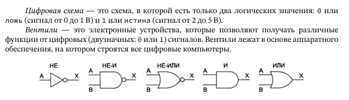

# **Вентили. Реализация булевых функций**

#### **1. Определение вентилей (логических элементов)**

**Вентиль** — это базовый элемент цифровой электроники, реализующий простейшую булеву функцию. Он принимает на вход один или несколько двоичных сигналов (0 или 1) и выдаёт результат в соответствии с таблицей истинности.

**Основные типы вентилей:**

| Название | Обозначение                                                          | Функция (`A`, `B` — входы) | Таблица истинности |
| ---------------- | ------------------------------------------------------------------------------- | --------------------------------------- | ----------------------------------- |
| **NOT**          |                  | Инверсия (`¬A`)                | `A                                  |
| **AND**          |                    | Логическое И (`A ∧ B`)      | `A B                                |
| **OR**           |                                  | Логическое ИЛИ (`A ∨ B`)  | `A B                                |
| **NAND**         |  | И-НЕ (`¬(A ∧ B)`)                  | Инверсия AND                |
| **NOR**          |                | ИЛИ-НЕ (`¬(A ∨ B)`)              | Инверсия OR                 |
| **XOR**          |                   | Исключающее ИЛИ (`A⊕B`)  | `A B                                |

#### **2. Реализация булевых функций с помощью вентилей**

Любую булеву функцию можно выразить через комбинацию базовых вентилей.

#### **3. Универсальные вентили**

* **NAND** и **NOR** называются *универсальными*, так как через них можно выразить **любую** булеву функцию.
* **Доказательство для NAND**:
  * `NOT A = A NAND A`,
  * `A AND B = (A NAND B) NAND (A NAND B)`,
  * `A OR B = (A NAND A) NAND (B NAND B)`.

#### **4. Физическая реализация вентилей**

Вентили реализуются на:

1. **Транзисторах**
2. Электромеханических схемах
3. **Оптических элементах** (в экспериментальных компьютерах).

### **Вывод**

Вентили — фундамент цифровой логики. Их комбинации позволяют строить сложные схемы: от сумматоров до процессоров. Универсальность `NAND`/`NOR` делает их ключевыми элементами при проектировании микросхем.
