# Комбинаторные схемы: мультиплексор, декодер, сумматор, АЛУ, компаратор, схема сдвига

### **Комбинационные и последовательностные схемы: сравнение и принципы работы**

В цифровой электронике все схемы делятся на два основных класса:

1. **Комбинационные (логические) схемы** — выход зависит только от текущих входов.
2. **Последовательностные схемы** — выход зависит от текущих входов **и предыдущего состояния** (имеют память).

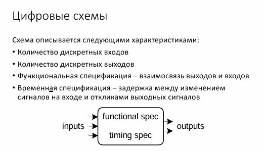

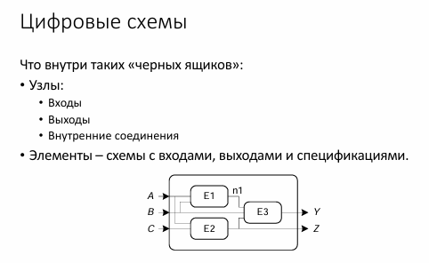

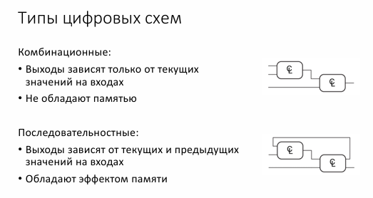

## **1. Комбинационные схемы**

### **Определение**

Схемы, в которых выходной сигнал определяется **только текущей комбинацией входных сигналов**. Не имеют памяти.

### **Характеристики**

* Нет памяти
* **Нет тактового сигнала** (не зависят от времени).
* **Простая структура**: вентили (AND, OR, NOT и др.).

### **Примеры**


| Схема                       | Функция                                                                          |
| -------------------------------- | --------------------------------------------------------------------------------------- |
| Мультиплексор (MUX) | Выбор одного из нескольких входов                          |
| Декодер                   | Преобразование двоичного кода в активный выход |
| Сумматор                 | Сложение двоичных чисел                                            |
| Компаратор             | Сравнение двух чисел                                                  |
| Шифратор                 | Преобразование активного входа в двоичный код   |

### **Реализация**

Любая комбинационная схема может быть описана:

* **Таблицей истинности**,
* **Логической формулой** (например, `F = A ∧ B ∨ ¬C`),
* **Схемой из вентилей**.

### **Недостатки**

* Не могут хранить состояние.
* Не подходят для задач, требующих памяти (например, счётчики).

## **2. Последовательностные схемы**

### **Определение**

Схемы, выход которых зависит **от текущих входов и предыдущего состояния** (имеют память).

### **Характеристики**

* Есть память (состояние сохраняется между тактами).
* **Тактирование** (синхронные) или **без тактирования** (асинхронные).
* **Сложнее комбинационных** (содержат триггеры, регистры).

### **Ключевые элементы**

1. **Триггеры** (D-триггер, JK-триггер, T-триггер) — хранят 1 бит.
2. **Регистры** — набор триггеров для хранения многоразрядных данных.
3. **Счётчики** — меняют состояние по тактовому сигналу.

### **Примеры**


| Схема                        | Функция                                                      |
| --------------------------------- | ------------------------------------------------------------------- |
| D-триггер                  | Хранение 1 бита данных                            |
| Сдвиговый регистр | Последовательный ввод/вывод данных   |
| Счётчик                    | Подсчёт импульсов (например, 0→1→2→3→0) |
| Конечный автомат   | Управление сложными алгоритмами        |

### **Типы последовательностных схем**

1. **Синхронные**

* Работают по тактовому сигналу (`CLK`).
* Пример: регистры в CPU.

2. **Асинхронные**

* Нет тактового сигнала, реагируют на изменения входов.
* Пример: асинхронные счётчики.

### **Применение**

* **Память** (RAM, регистры).
* **Управление** (конечные автоматы в процессорах).
* **Обработка данных** (сдвиговые регистры в UART).

## **3. Сравнительная таблица**


| **Критерий**                    | **Комбинационные схемы**           | **Последовательностные схемы**               |
| --------------------------------------- | ----------------------------------------------------- | --------------------------------------------------------------------- |
| **Зависимость выхода** | Только от текущих входов         | От входов и предыдущего состояния        |
| **Память**                        | Нет                                                | Есть (триггеры, регистры)                         |
| **Тактирование**            | Не требуют тактового сигнала | Синхронные/асинхронные                           |
| **Сложность**                  | Проще (только вентили)              | Сложнее (вентили + память)                        |
| **Примеры**                      | MUX, декодер, сумматор                 | Триггеры, счётчики, конечные автоматы |

## **4. Комбинированные схемы**

На практике большинство устройств сочетают оба типа: **АЛУ в CPU**: комбинационная часть (сумматор) + последовательностная (регистры).

* **Контроллеры**: комбинационная логика + конечный автомат.

## **1. Мультиплексор (MUX)**

### **Определение**

Мультиплексор — это схема, которая выбирает **один** из нескольких входных сигналов и передаёт его на выход в зависимости от управляющих сигналов.

> Схема с 2^𝑛 входами, одним выходом и 𝑛 линиями  управления, которые позволяют выбрать один из входов.  Мультиплексорыможноиспользоватьдляреализациибуле вой функции𝑛переменных.

### **Принцип работы**

- Имеет **N** входов данных (`D0, D1, ..., Dn-1`).
- **log₂N** управляющих входов (`S0, S1, ...`).
- **1 выход (`Y`)**.

### **Формула работы**

Для 4-входового мультиплексора (2 управляющих входа):

```
Y = (¬S1 ∧ ¬S0 ∧ D0) ∨ (¬S1 ∧ S0 ∧ D1) ∨ (S1 ∧ ¬S0 ∧ D2) ∨ (S1 ∧ S0 ∧ D3)
```

### **Применение**

- Выбор сигналов в процессорах.
- Реализация логических функций (заменяет несколько вентилей).

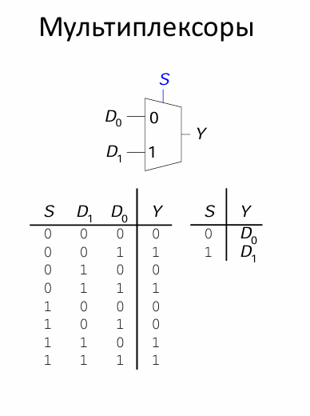

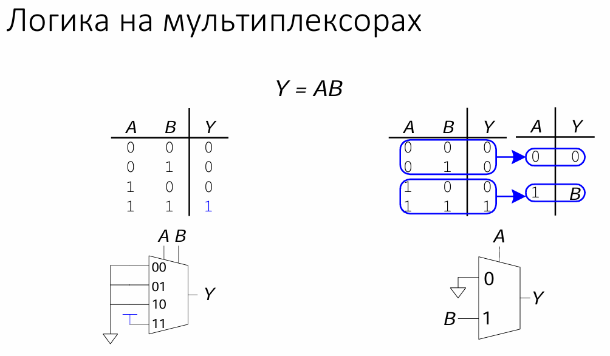

## **2. Декодер (Decoder)**

### **Определение**

Декодер преобразует **n-битный входной код** в **2ⁿ выходных сигналов**, активируя только один выход в зависимости от входного значения.

> Схема, которая получает на входе 𝑛-разрядное число и  использует его для того, чтобы выбрать (то есть установить  в 1) одну из 2𝑛 выходных линий.

### **Принцип работы**

- **n входов** (адресные линии).
- **2ⁿ выходов** (обычно активный уровень — `1`).

### **Пример: 2-входовой декодер (→ 4 выхода)**


| **A1 A0** | **Y3 Y2 Y1 Y0** |
| --------- | --------------- |
| 0 0       | 0 0 0 1         |
| 0 1       | 0 0 1 0         |
| 1 0       | 0 1 0 0         |
| 1 1       | 1 0 0 0         |

### **Применение**

- Адресация памяти (выбор строки в RAM).
- Управление периферией (в микроконтроллерах).

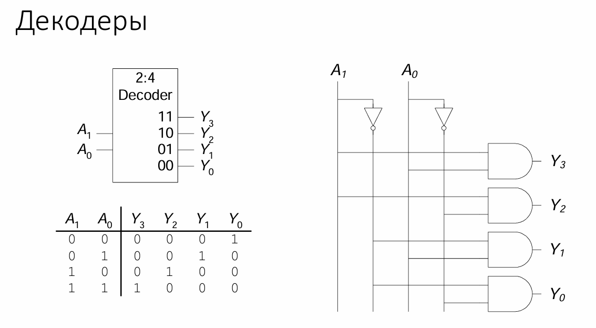

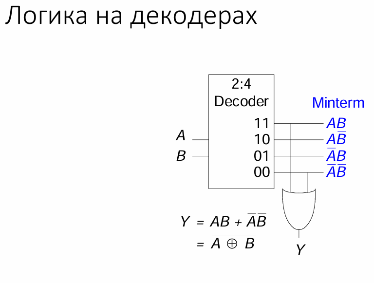

## **3. Сумматор (Adder)**

### **Определение**

Сумматор — это **комбинационная схема**, выполняющая арифметическое сложение двоичных чисел

### **Типы сумматоров**

1. **Полусумматор (Half Adder)**

   > Складывает **2 бита** без учёта переноса из предыдущего разряда.
   >

   - Складывает **2 бита** (`A`, `B`).
   - Выходы: `Sum = A ⊕ B`, `Carry = A ∧ B`.


2. **Полный сумматор (Full Adder)**

> Складывает **3 бита**: `A`, `B` и входной перенос `Cin` от предыдущего разряда.

- Складывает **3 бита** (`A`, `B`, `Cin` — перенос из предыдущего разряда).
- Выходы:
  ```
  Sum = A ⊕ B ⊕ Cin  
  Cout = (A ∧ B) ∨ (Cin ∧ (A ⊕ B))  
  ```

3. **Многоразрядный сумматор (Ripple Carry Adder)**

> Цепочка из полных сумматоров, где перенос передаётся последовательно.

- Цепочка из полных сумматоров (разряд за разрядом).

### **Применение**

- Арифметико-логические устройства (АЛУ).
- Процессоры, криптография.

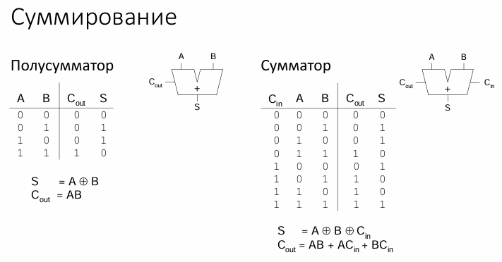

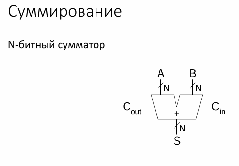

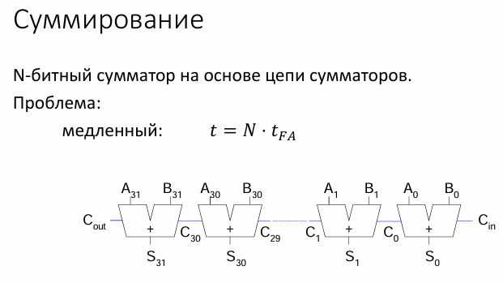

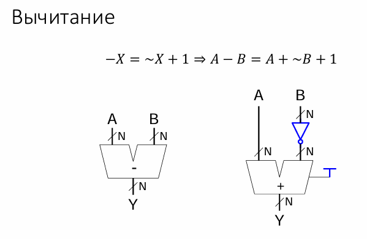

## **4. Арифметико-логическое устройство (АЛУ)**

### **Определение**

Комбинационная схема, выполняющая **арифметические** (+, −) и **логические** (AND, OR, XOR) операции.

### **Основные компоненты**

- **Сумматор** (для сложения/вычитания).
- **Логические вентили** (AND, OR, NOT, XOR).
- **Мультиплексор** (выбор операции).

### **Пример операций 4-битного АЛУ**


| **Операция** | **Результат**                                    |
| -------------------- | --------------------------------------------------------- |
| ADD (A + B)          | Арифметическая сумма                   |
| SUB (A − B)         | Разность (через дополнение до 2) |
| AND (A ∧ B)         | Побитовое И                                     |
| OR (A ∨ B)          | Побитовое ИЛИ                                 |

### **Применение**

- Центральный процессор (CPU).
- Цифровая обработка сигналов (DSP).

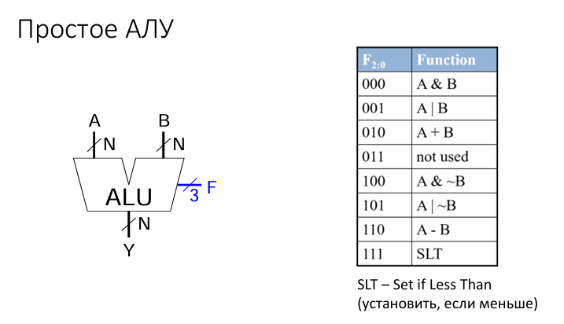

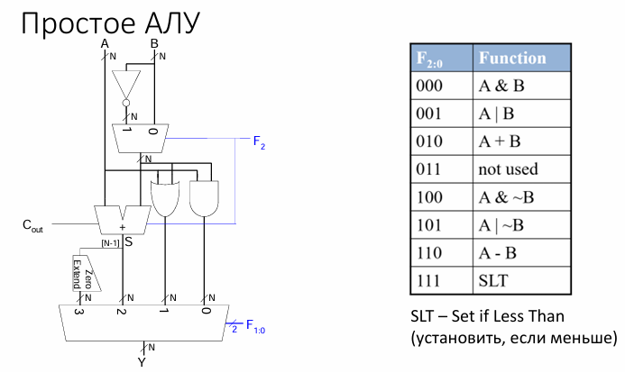

## **5. Компаратор (Comparator)**

### **Определение**

Схема, сравнивающая **два числа** и выдающая результат (`A > B`, `A = B`, `A < B`).

### **Принцип работы**

1. **Побитовое сравнение** (начиная со старшего разряда).
2. **Выходные сигналы**:
   - `A > B` = `1`, если найдён разряд, где `Ai > Bi`.
   - `A = B` = `1`, если все биты равны.
   - `A < B` = `1`, если `A > B` и `A = B` неактивны.

### **Пример: 1-битный компаратор**


| **A B** | **A > B** | **A = B** | **A < B** |
| ------- | --------- | --------- | --------- |
| 0 0     | 0         | 1         | 0         |
| 0 1     | 0         | 0         | 1         |
| 1 0     | 1         | 0         | 0         |
| 1 1     | 0         | 1         | 0         |

### **Применение**

- Сортировка данных.
- Управление алгоритмами (например, ветвление в процессоре).

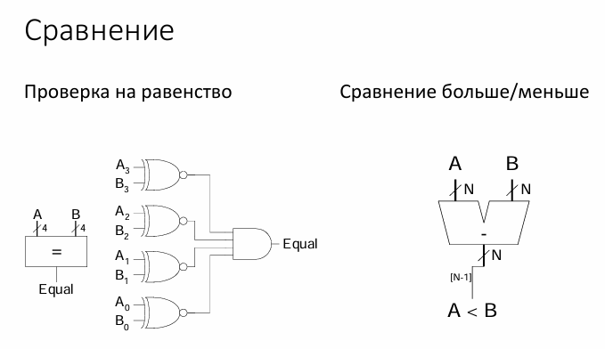

## **6. Схема сдвига (Shifter)**

### **Определение**

Схема, выполняющая **логический** или **арифметический** сдвиг двоичного числа.

### **Типы сдвигов**

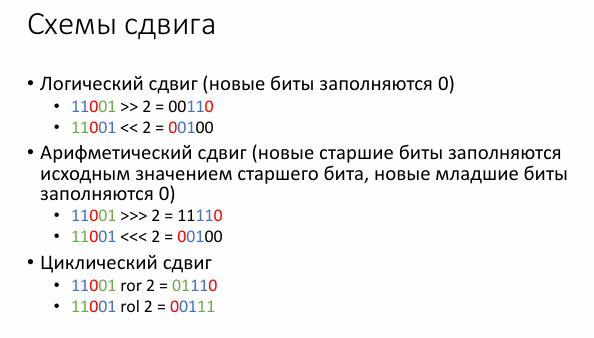

1. **Логический сдвиг**

   - Вправо: `A >> 1` (в старший разряд пишется `0`).
   - Влево: `A << 1` (в младший разряд пишется `0`).
2. **Арифметический сдвиг**

   - Вправо: сохраняет знак (старший бит копируется).
   - Влево: аналогичен логическому.

### **Реализация**

- **Последовательная** (с использованием триггеров).
- **Комбинационная** (мультиплексоры + вентили).

### **Применение**

- Умножение/деление на степени двойки.
- Обработка чисел с плавающей запятой.


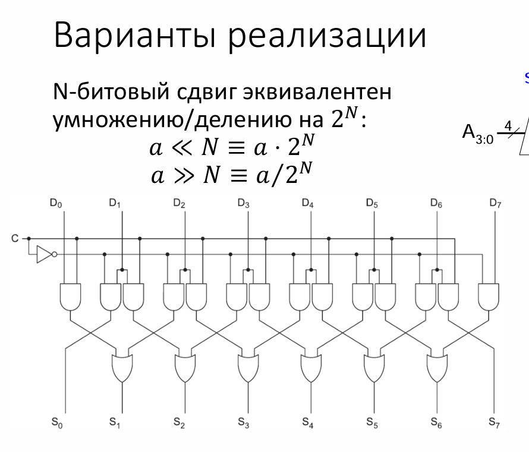

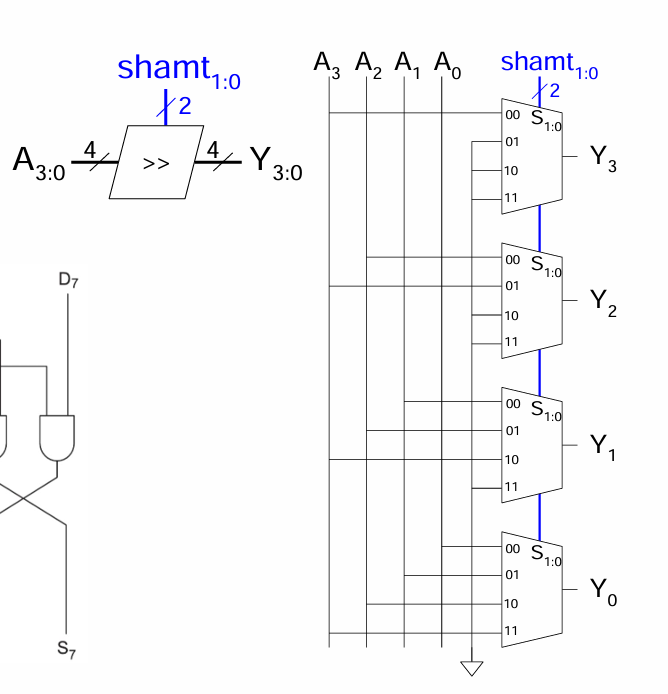

## **Сравнительная таблица комбинационных схем**


| **Схема**             | **Функция**                           | **Ключевые компоненты**                       | **Пример применения**      |
| -------------------------- | -------------------------------------------- | --------------------------------------------------------------- | ------------------------------------------ |
| Мультиплексор | Выбор одного из входов    | AND, OR, NOT                                                    | Управление данными в CPU |
| Декодер             | Активация одного выхода | AND, NOT                                                        | Адресация памяти            |
| Сумматор           | Сложение двоичных чисел | XOR, AND, OR                                                    | АЛУ, процессоры               |
| АЛУ                     | Арифметика + логика          | Сумматор, MUX, вентили                           | Центральный процессор  |
| Компаратор       | Сравнение чисел                | XOR, AND                                                        | Условные переходы          |
| Схема сдвига    | Сдвиг битов                        | MUX, триггеры (для последовательных) | Умножение/деление          |

## **Вывод**

Комбинационные схемы — основа цифровой электроники. Они позволяют реализовать:

- **Выбор данных** (мультиплексоры),
- **Декодирование** (декодеры),
- **Арифметику** (сумматоры, АЛУ),
- **Сравнение** (компараторы),
- **Битовые операции** (сдвиги).

Их комбинации используются в **процессорах**, **памяти** и других сложных цифровых устройствах.
