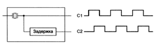

# Тактовые генераторы. Элементы памяти: синхронные SR-защёлки, D-триггеры

## **1. Тактовые генераторы**

### **Определение**

Тактовый генератор — это электронная схема, генерирующая **периодические импульсы** (тактовый сигнал), которые синхронизируют работу цифровых устройств.

### **Основные параметры**

* **Частота** (Гц) — количество импульсов в секунду.
* **Скважность** — отношение периода к длительности импульса.
* **Стабильность** — зависит от типа генератора (кварцевые, RC-генераторы).

> Это схема, которая вызывает серию им пульсов одинаковой длительности. Интерва лы между последовательными импульсами  также одинаковы. Временной интервал меж ду началомодногоимпульсаиначаломследу ющегоназывается временем такта.  Частота импульсов обычно составляет от 1 до 500МГц (время такта от 1000 до 2нс).  Частота тактового генератора как правило контролируется кварцевым генератором, позво ляющимдобиться высокой точности. Схемы могут запускаться не только уровнем сигнала,  но также фронтомилиспадом

## 2. Элементы памяти

### Триггеры и защёлки

> Защелки и триггеры – простейшие последовательностные схемы,  запоминающие один бит информации

Триггеры и защелки — это два вида схем памяти, используемых в электронике. Основное различие между ними заключается в том, как они реагируют на изменения. Защелка меняет свой выходной сигнал всякий раз, когда меняется входной сигнал. Это означает, что она всегда готова к реагированию. С другой стороны, триггер меняет свой выходной сигнал только в определенные моменты, например, когда управляющий сигнал переходит из низкого уровня в высокий. Это делает триггеры более стабильными во многих ситуациях.

### Бистабильная ячейка

Бистабильная ячейка — **это простейший тип триггера, выполняющий только хранение информации**

## 2.1. SR-защёлки

### SR-защелки

Чтобы создать один бит памяти, нужна схема, которая каким-то образом «за­поминает» предыдущие входные значения. Такую схему можно сконструировать из двух вентилей *НЕ-ИЛИ*, как показано Рис. 3.24. Аналогичные схемы мож­но построить из вентилей *НЕ-И*.

## Синхронные SR-защёлки

Часто бывает удобно сделать так, чтобы защелка меняла состояние только в опре­деленные моменты. Чтобы достичь этой цели, необходимо немного изменить основную схему и тогда мы получим ***синхронную SR-защелку*** (Рис. 3 .25).

Эта схема имеет дополнительный синхронизирующий вход, который обычно равен 0. Если этот вход равен 0, то оба выхода вентилей *И* равны 0 независимо от *S* и *R*, и защелка не меняет состояние. Когда значение синхронизирующего входа равно 1, действие вентилей *И* исчезает и состояние защелки становится зависи­мым от *S* и *R*. Для обозначения того факта, что синхронизирующий вход равен 1 (то есть состояние схемы зависит от значений *S* и *R*), часто используется термин ***стробировать***.

## D-защёлка

Синхронные D-защелки  Чтобы разрешить ситуацию с неопределенностью SR-защелки (неопределенность  возникает в случае, если S = R = 1), нужно предотвратить ее возникновение.

На рис. 3.22 изображена схема защелки только с одним входом D. Так как  входной сигнал в нижний вентиль И всегда является обратным кодом входного  сигнала в верхний вентиль И, ситуация, когда оба входа равны 1, никогда не  возникает. Когда D = 1 и синхронизирующий вход равен 1, защелка переходит  в состояние Q = 1. Когда D = 0 и синхронизирующий вход равен 1, защелка  переходит в состояние Q = 0. Другими словами, когда синхронизирующий вход  равен 1, текущее значение D отбирается и сохраняется в защелке. Такая схе ма, которая называется синхронной D-защелкой, представляет собой память  объемом один бит. Сохраненное значение всегда доступно на выходе Q. Чтобы  загрузить в память текущее значение D, нужно пустить положительный импульс  по линии синхронизирующего сигнала.

Такая схема требует 11 транзисторов. Более сложные схемы (именно они  обычно используются на практике) могут хранить один бит всего на 6 транзи сторах. Схема остается в устойчивом состоянии до тех пор, пока на нее подается  питание (на рисунке не обозначено). Позднее мы рассмотрим схемы, которые  быстро забывают состояние, в котором они находятся, — чтобы этого не проис ходило, им необходимы постоянные «напоминания»

## **2.2. D-триггер**

Существуют несколько подходов к проектированию триггеров. Например, если бы существовал способ генерирования очень короткого импульса на фронте синхронизирующего сигнала, этот импульс можно было бы подавать в D-защелку. В действительности такой способ существует.

