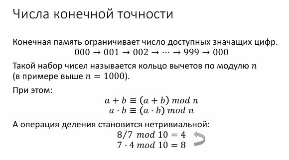
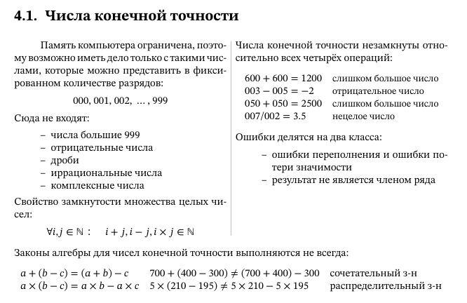

# Алгебра конечных чисел

### **Числа конечной точности в компьютерах**

#### **1. Проблема представления чисел в ЭВМ**

- В отличие от людей, компьютеры работают с числами **конечной точности** — их память ограничена, поэтому числа имеют фиксированное количество разрядов.
- Пример: трёхразрядные десятичные числа (000–999) не могут представить:
  - числа > 999,
  - отрицательные числа,
  - дроби,
  - иррациональные и комплексные числа.

#### **2. Нарушение замкнутости операций**

**Замкнутость операции** — это свойство множества, при котором применение определённой операции к любым двум его элементам даёт результат, также принадлежащий этому множеству.

- В классической арифметике целые числа замкнуты относительно сложения, вычитания и умножения, но не деления.
- В компьютерах числа конечной точности **не замкнуты ни для одной операции**:
  - **Переполнение**: результат превышает максимальное значение (600 + 600 = 1200).
  - **Потеря значимости**: результат меньше минимального значения (003 – 005 = –2).
  - **Недопустимый тип**: результат не является целым числом (007 / 002 = 3.5).

#### **3. Нарушение математических законов**

Из-за ограничений памяти стандартные алгебраические законы могут не работать:

- **Ассоциативный закон**:
  Пример: `700 + (400 – 300) = 800`, но `(700 + 400) – 300` вызывает переполнение и даёт неверный результат.
- **Дистрибутивный закон**:
  Пример: `5 × (210 – 195) = 75`, но `5 × 210 – 5 × 195` приводит к переполнению.

#### **4. Вывод**

- Компьютеры **не идеальны для точной арифметики** из-за ограничений памяти.
- Важно учитывать:
  - **Порядок операций** (из-за возможного переполнения).
  - **Диапазон представимых чисел**.
- Понимание этих ограничений критично для корректного программирования и обработки данных.

**Итог**:
Числа конечной точности — это компромисс между удобством вычислений и физическими ограничениями ЭВМ. Их использование требует осторожности, особенно в критичных расчётах (финансы, криптография, научные вычисления).
