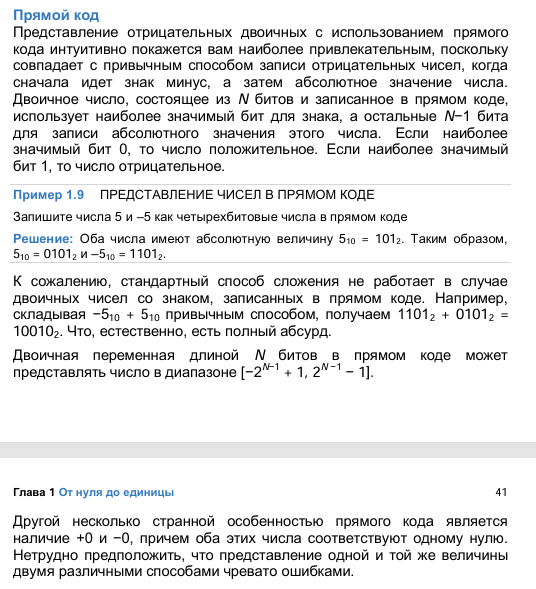
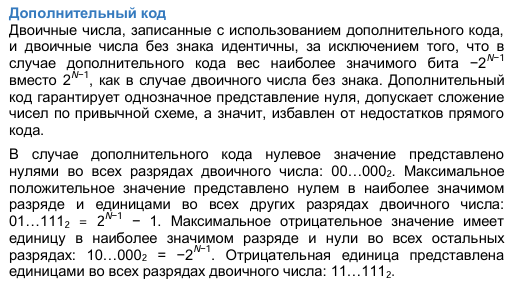
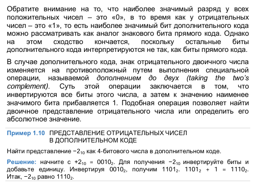
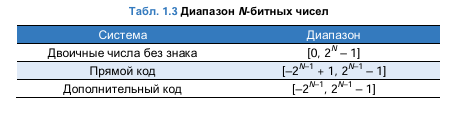

# Целые числа: положительные и отрицательные

## **1. Беззнаковые (unsigned) целые числа**

### **1.1. Диапазон значений**

Для `n` бит:

- Минимальное: 0
- Максимальное: 2ⁿ - 1

**Примеры:**

- 8 бит: 0..255
- 16 бит: 0..65535

### 1.2. Особенности

- Нет отрицательных значений
- Переполнение: 255 + 1 = 0 (для 8 бит)

## **2. Знаковые (signed) целые числа**

### **2.1. Способы представления отрицательных чисел**

1. **Прямой код** (sign-magnitude):

   - Старший бит – знак (0 = +, 1 = -)
   - Остальные биты – абсолютное значение
   - Недостаток: два нуля (+0 и -0)
2. **Обратный код** (ones' complement):

   - Отрицательные числа – инверсия битов положительных
   - Также два нуля
3. **Дополнительный код** (two's complement) – стандарт в современных ЭВМ
4. Представление чисел со смещением

Способ кодирования целых чисел, где все значения **сдвинуты** на фиксированную величину N=2^(m−1) (для m бит). Позволяет представлять отрицательные числа **без явного бита знака**.

### **2.2. Дополнительный код**

#### **Диапазон для `n` бит:**

- Минимальное: -2ⁿ⁻¹
- Максимальное: 2ⁿ⁻¹ - 1

**Примеры:**

- 8 бит: -128..127
- 16 бит: -32768..32767

#### **Преимущества:**

- Один ноль (0..0)
- Простота арифметических операций
- Естественное переполнение

#### **Представление отрицательных чисел:**

1. Записать модуль числа в двоичном виде
2. Инвертировать все биты
3. Добавить 1

**Пример (-5 для 8 бит):**

1. 5 = 00000101
2. Инверсия: 11111010
3. +1: 11111011

---

---

|   |   |   |   |    | Прямой код                                                                 | Обратный код                                                                       | Дополнительный ход                                                                                                                        | Со смещением (обычно на 2^(n-1))                   |
| - | - | - | - | -- | ----------------------------------------------------------------------------------- | --------------------------------------------------------------------------------------------- | ---------------------------------------------------------------------------------------------------------------------------------------------------------- | --------------------------------------------------------------------- |
| 1 | 1 | 1 | 1 | 15 | -7                                                                                  | -0                                                                                            | -1                                                                                                                                                         | 7                                                                     |
| 1 | 1 | 1 | 0 | 14 | -6                                                                                  | -1                                                                                            | -2                                                                                                                                                         | 6                                                                     |
| 1 | 1 | 0 | 1 | 13 | -5                                                                                  | -2                                                                                            | -3                                                                                                                                                         | 5                                                                     |
| 1 | 1 | 0 | 0 | 12 | -4                                                                                  | -3                                                                                            | -4                                                                                                                                                         | 4                                                                     |
| 1 | 0 | 1 | 1 | 11 | -3                                                                                  | -4                                                                                            | -5                                                                                                                                                         | 3                                                                     |
| 1 | 0 | 1 | 0 | 10 | -2                                                                                  | -5                                                                                            | -6                                                                                                                                                         | 2                                                                     |
| 1 | 0 | 0 | 1 | 9  | -1                                                                                  | -6                                                                                            | -7                                                                                                                                                         | 1                                                                     |
| 1 | 0 | 0 | 0 | 8  | -0                                                                                  | -7                                                                                            | -8                                                                                                                                                         | 0                                                                     |
| 0 | 1 | 1 | 1 | 7  | 7                                                                                   | 7                                                                                             | 7                                                                                                                                                          | -1                                                                    |
| 0 | 1 | 1 | 0 | 6  | 6                                                                                   | 6                                                                                             | 6                                                                                                                                                          | -2                                                                    |
| 0 | 1 | 0 | 1 | 5  | 5                                                                                   | 5                                                                                             | 5                                                                                                                                                          | -3                                                                    |
| 0 | 1 | 0 | 0 | 4  | 4                                                                                   | 4                                                                                             | 4                                                                                                                                                          | -4                                                                    |
| 0 | 0 | 1 | 1 | 3  | 3                                                                                   | 3                                                                                             | 3                                                                                                                                                          | -5                                                                    |
| 0 | 0 | 1 | 0 | 2  | 2                                                                                   | 2                                                                                             | 2                                                                                                                                                          | -6                                                                    |
| 0 | 0 | 0 | 1 | 1  | 1                                                                                   | 1                                                                                             | 1                                                                                                                                                          | -7                                                                    |
| 0 | 0 | 0 | 0 | 0  | +0                                                                                  | +0                                                                                            | 0                                                                                                                                                          | -8                                                                    |
|   |   |   |   |    | Если первый бит отдаём под знак числа                | Делаем инвертацию для отрицательных значений          | Инвертируем биты положительного числа, чтобы получить  отрицательное и прибавляем 1 | Будем считать, что 0 начинается не с 0000 |
|   |   |   |   |    | [-2^(n-1)+1, 2^(n-1)-1]                                                             | [-2^(n-1)+1, 2^(n-1)-1]                                                                       | Преимущества: только один 0                                                                                                          | x = y - 2^(n-1)                                                       |
|   |   |   |   |    | Серьёзный минус возникает при сложении чисел | Пример: 1 = 0001, -1 = 1110                                                             | [-2^(n-1), 2^(n-1)-1]                                                                                                                                      | 8-8=0                                                                 |
|   |   |   |   |    | -1'+1'=2                                                                            | -'1 + 1 = -'0                                                                                 | -1+1 = 0 Игнорируем бит переноса, просто отбрасываем                                                                 |                                                                       |
|   |   |   |   |    |                                                                                     | 1 + -2 = -1                                                                                   |                                                                                                                                                            |                                                                       |
|   |   |   |   |    |                                                                                     | -'1 + -2 = -2, а должно быть -3                                                    |                                                                                                                                                            |                                                                       |
|   |   |   |   |    |                                                                                     | Так произошло из-за переполнения разрядов                 |                                                                                                                                                            |                                                                       |
|   |   |   |   |    |                                                                                     | Чтобы работало, надо 1 прибавить к МЛАДШЕМУ разряду |                                                                                                                                                            |                                                                       |

Сейчас обратный код считается устаревшим

Во всех компьютерах сейчас используется дополнительный ход

## **3. Особые случаи**

### **3.1. Минимальное отрицательное число**

Для 8 бит: -128 (10000000)

- Особенность: -128 * (-1) = -128 (переполнение)

// Рассматривается дополнительный код

### **3.2. Проверка на переполнение**

Флаги процессора:

- OF (Overflow Flag) – для знаковых чисел
- CF (Carry Flag) – для беззнаковых чисел
