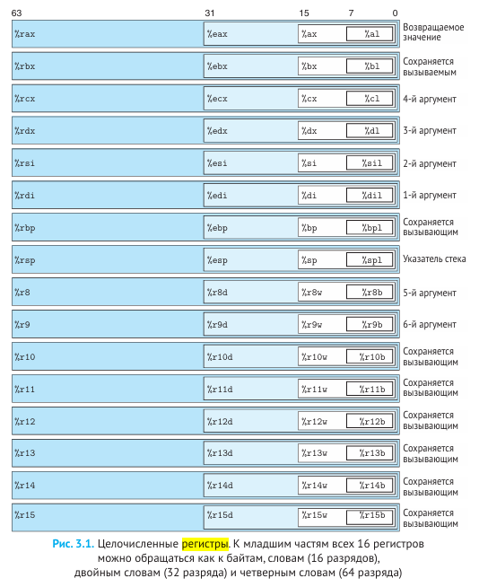

# Схематическое устройство ЭВМ. Основные регистры ЦП. Их назначение.

#### **1. Схематическое устройство ЭВМ (классическая архитектура фон Неймана)**

Основные компоненты ЭВМ:

1. **Центральный процессор (ЦП)** – выполняет вычисления и управляет работой системы.
2. **Оперативная память (ОЗУ)** – хранит данные и команды программ.
3. **Устройства ввода/вывода (I/O)** – взаимодействие с внешними устройствами (клавиатура, монитор и др.).
4. **Системная шина** – обеспечивает обмен данными между компонентами (шина данных, адреса и управления).

**Принципы работы:**

* **Принцип программного управления**: Команды выполняются последовательно (с возможностью ветвлений).
* **Принцип однородности памяти**: Данные и команды хранятся в одной памяти.
* **Принцип адресности**: Каждая ячейка памяти имеет уникальный адрес.

---

#### **2. Основные регистры ЦП и их назначение**

**Регистры** – сверхбыстрая память внутри процессора для временного хранения данных, адресов и управляющей информации.

##### **1. Регистры общего назначения (РОН)**

* Используются для арифметико-логических операций.
* Примеры:
  * **AX (Accumulator)** – хранение результатов операций.
  * **BX (Base)** – хранение базовых адресов.
  * **CX (Counter)** – счётчик циклов.
  * **DX (Data)** – хранение данных и результатов умножения/деления.

##### **2. Сегментные регистры**

* Определяют сегменты памяти (актуально для 16- и 32-битных систем).
* Примеры:
  * **CS (Code Segment)** – хранение адреса сегмента кода.
  * **DS (Data Segment)** – хранение адреса сегмента данных.
  * **SS (Stack Segment)** – хранение адреса сегмента стека.
  * **ES (Extra Segment)** – дополнительный сегмент данных.

##### **3. Управляющие регистры**

* **IP (Instruction Pointer)** – указатель на следующую команду.
* **FLAGS (регистр флагов)** – хранит состояние процессора (флаги):
  * **ZF (Zero Flag)** – результат операции равен нулю.
  * **CF (Carry Flag)** – перенос/заём в арифметических операциях.
  * **SF (Sign Flag)** – знак результата (отрицательный/положительный).
  * **OF (Overflow Flag)** – переполнение при операции.

##### **4. Регистры стека**

* **SP (Stack Pointer)** – указатель вершины стека.
* **BP (Base Pointer)** – указатель базы стека (для доступа к локальным переменным).

##### **5. Специальные регистры (в современных процессорах)**

* **CR0-CR4 (Control Registers)** – управление режимами работы ЦП.
* **MMX, XMM (для SIMD-операций)** – ускорение мультимедийных вычислений.

Центральное процессорное устройство (Central Processing Unit, CPU) с архитектурой  x86-64 имеет набор из 16 регистров общего назначения, способных хранить 64-разряд ные значения. Эти регистры используются для хранения целочисленных данных, а  также указателей.

---

#### **3. Пример работы регистров**

**Команда:** `ADD AX, BX` (сложение AX и BX).

1. **AX** и **BX** загружаются значениями.
2. Результат сохраняется в **AX**.
3. **FLAGS** обновляются (ZF, CF, SF, OF).

---

#### **4. Вывод**

* Регистры ЦП – ключевые элементы для выполнения команд и управления данными.
* Разные типы регистров оптимизированы под конкретные задачи (арифметика, управление памятью, стеком и т. д.).
* Понимание их работы необходимо для программирования на низком уровне (ассемблер, драйверы, оптимизация кода).
