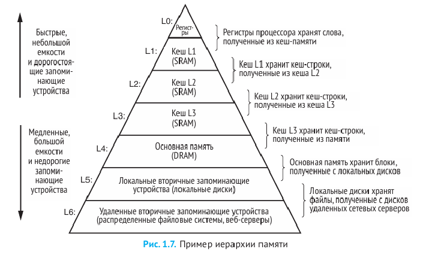
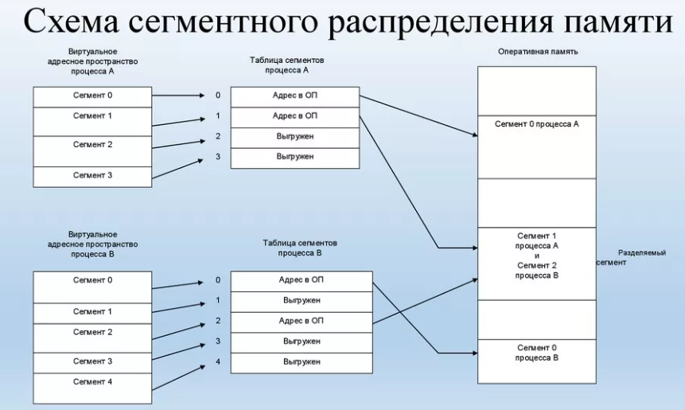
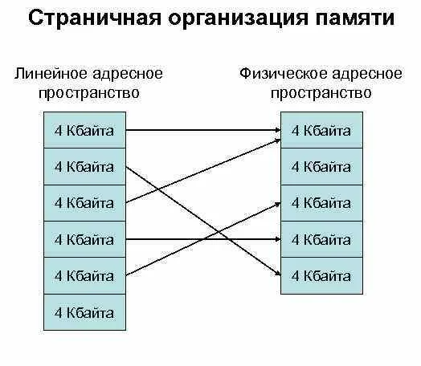

# **Структура программы. Модель памяти. Формат команд. Формы операндов**

## **1. Структура программы на низком уровне**

Программа в машинных кодах или ассемблере имеет четкую организацию, определяющую расположение кода, данных и служебной информации. Рассмотрим подробно каждый компонент.

### **1.1. Сегменты программы**

#### **(1) Сегмент кода (Code Segment, .text)**

**Назначение**:

- Содержит исполняемые инструкции процессора.
- Доступен только для чтения во время выполнения (защита от модификации кода).

**Особенности**:

- Начинается с **точки входа** (например, `_start` в Linux или `main` в C-программах).
- Может содержать подпрограммы (функции).
- Выравнивание команд для оптимизации (обычно по 16 байт).

**Пример (NASM x86):**

```asm
section .text
global _start   ; Точка входа для линкера

_start:
    mov eax, 4  ; Системный вызов write
    mov ebx, 1  ; stdout
    mov ecx, msg
    mov edx, len
    int 0x80    ; Вызов ядра
```

#### **(2) Сегмент данных (Data Segment, .data и .bss)**

**Назначение**:

- Хранение глобальных и статических переменных.

**Подсегменты**:

- **.data** – инициализированные данные (значения известны на этапе компиляции).
- **.bss** (Block Started by Symbol) – неинициализированные данные (выделяется место, но без явного значения).

**Пример:**

```asm
section .data
    msg db 'Hello, World!', 0xA  ; Строка с символом новой строки
    len equ $ - msg              ; Длина строки

section .bss
    buffer resb 256              ; Буфер на 256 байт (не инициализирован)
```

#### **(3) Сегмент стека (Stack Segment)**

**Назначение**:

- Динамическое хранение временных данных:
  - Локальные переменные функций.
  - Адреса возврата из подпрограмм.
  - Аргументы функций.

**Организация**:

- **LIFO** (Last In, First Out) – последний добавленный элемент извлекается первым.
- Управляется регистрами:
  - **ESP (Stack Pointer)** – указывает на вершину стека.
  - **EBP (Base Pointer)** – база текущего стекового кадра.

**Пример работы стека:**

```asm
push eax  ; Помещает значение EAX на стек (ESP уменьшается)
pop ebx   ; Извлекает значение в EBX (ESP увеличивается)
```

#### **(4) Дополнительные сегменты**

- **.rodata** (Read-Only Data) – константные данные (строки, числа).
- **.heap** – динамическая память (выделяется через `malloc`/`new`).

### **1.2. Точка входа и завершение программы**

* Точка входа (_start, main) - первая исполняемая команда
* Завершение программы - системный вызов (например, int 0x80 в Linux, ExitProcess в Windows)

### **2. Пример полной структуры программы**

**Файл `example.asm` (NASM, x86 Linux):**

```asm
section .data
    hello db "Hello, ASM!", 0xA  ; 0xA = '\n'
    hello_len equ $ - hello

section .bss
    input resb 32                ; Буфер для ввода

section .text
global _start

_start:
    ; Вывод строки
    mov eax, 4                   ; sys_write
    mov ebx, 1                   ; stdout
    mov ecx, hello
    mov edx, hello_len
    int 0x80

    ; Завершение программы
    mov eax, 1                   ; sys_exit
    xor ebx, ebx                 ; код возврата 0
    int 0x80
```

### **3. Этапы формирования программы**

1. **Компиляция**
   - Ассемблер преобразует исходный код в объектный файл (`.o`).
2. **Линковка**
   - Компоновщик объединяет объектные файлы и библиотеки в исполняемый файл.
3. **Загрузка**
   - ОС размещает программу в памяти, настраивает сегменты и передает управление.

## **Вывод**

Программа состоит из сегментов кода, данных и стека, каждый из которых имеет строгое назначение.


## **2. Модель памяти**

Модель памяти - это абстракция, описывающая способы организации, адресации и доступа к памяти в вычислительной системе. Она определяет:

* Как процессор видит память
* Как адресуются ячейки памяти
* Какие механизмы защиты и управления памятью существуют

Современные системы используют многоуровневую иерархию памяти:

1. **Регистры процессора** (наиболее быстрые, 1-3 такта доступа)
2. **Кэш-память** (L1, L2, L3 - 3-30 тактов)
3. **Основная память (ОЗУ)** (50-200 тактов)
4. **Внешняя память** (диски, SSD - тысячи тактов)



**В компьютерных системах используются разные модели памяти**, которые определяют, как код, данные и стек программы размещаются в памяти. Основные модели: плоская, сегментированная и страничная.

### **2.1. Линейная, сегментная и страничная модели памяти**

#### Плоская модель

**В плоской модели** код и данные совместно используют одно и то же адресное пространство. Это упрощает доступ к данным и ускоряет выполнение программ.  [6](https://ru.wikipedia.org/wiki/%D0%9F%D0%BB%D0%BE%D1%81%D0%BA%D0%B0%D1%8F_%D0%BC%D0%BE%D0%B4%D0%B5%D0%BB%D1%8C_%D0%BF%D0%B0%D0%BC%D1%8F%D1%82%D0%B8)[8](https://ru.ruwiki.ru/wiki/%D0%9F%D0%BB%D0%BE%D1%81%D0%BA%D0%B0%D1%8F_%D0%BC%D0%BE%D0%B4%D0%B5%D0%BB%D1%8C_%D0%BF%D0%B0%D0%BC%D1%8F%D1%82%D0%B8)

Объём адресуемой памяти зависит от разрядности процессора: для 16-битных процессоров — 64 КБ, для 32-битных — до 4 ГБ, для 64-битных — до 16 эксабайт (для процессоров AMD64 — до 256 ТБ).  [6](https://ru.wikipedia.org/wiki/%D0%9F%D0%BB%D0%BE%D1%81%D0%BA%D0%B0%D1%8F_%D0%BC%D0%BE%D0%B4%D0%B5%D0%BB%D1%8C_%D0%BF%D0%B0%D0%BC%D1%8F%D1%82%D0%B8)[8](https://ru.ruwiki.ru/wiki/%D0%9F%D0%BB%D0%BE%D1%81%D0%BA%D0%B0%D1%8F_%D0%BC%D0%BE%D0%B4%D0%B5%D0%BB%D1%8C_%D0%BF%D0%B0%D0%BC%D1%8F%D1%82%D0%B8)

#### Сегментированная модель

**В сегментированной модели** память для программы делится на непрерывные области — сегменты. Программа может обращаться только к данным, которые находятся в этих сегментах.  [2](https://prog-cpp.ru/asm-memory/)[22](http://mf.grsu.by/UchProc/livak/b_org/oal_8.htm)

Сегмент — независимый, поддерживаемый на аппаратном уровне блок памяти. Для обращения к данным внутри сегмента обращение производится относительно начала сегмента линейно — начиная с 0 и заканчивая адресом, равным размеру сегмента.  [2](https://prog-cpp.ru/asm-memory/)[22](http://mf.grsu.by/UchProc/livak/b_org/oal_8.htm)



#### Страничная модель

**В страничной модели** виртуальное адресное пространство процесса делится на фиксированные блоки — страницы. Физическая память также делится на блоки того же размера — фреймы. Страницы и фреймы имеют одинаковый размер, что упрощает их сопоставление.  [13](https://vseloved.github.io/pdf/mem-ru.pdf)[14](https://moodle.kstu.ru/pluginfile.php/655201/mod_resource/content/1/%D0%9B%D0%B5%D0%BA%D1%86%D0%B8%D1%8F%20%E2%84%96%2016.pdf)

Часть виртуального адреса интерпретируется как номер страницы, а часть — как смещение внутри страницы. Если физическая память заполнена, операционная система может выгрузить некоторые страницы на диск (в своп).  [13](https://vseloved.github.io/pdf/mem-ru.pdf)[14](https://moodle.kstu.ru/pluginfile.php/655201/mod_resource/content/1/%D0%9B%D0%B5%D0%BA%D1%86%D0%B8%D1%8F%20%E2%84%96%2016.pdf)



#### Примеры использования

* **Плоская модель** используется в большинстве современных 32- и 64-разрядных операционных систем, например, в Windows и Linux.  [1](https://osdev.fandom.com/ru/wiki/%D0%9C%D0%BE%D0%B4%D0%B5%D0%BB%D0%B8_%D0%BF%D0%B0%D0%BC%D1%8F%D1%82%D0%B8)[6](https://ru.wikipedia.org/wiki/%D0%9F%D0%BB%D0%BE%D1%81%D0%BA%D0%B0%D1%8F_%D0%BC%D0%BE%D0%B4%D0%B5%D0%BB%D1%8C_%D0%BF%D0%B0%D0%BC%D1%8F%D1%82%D0%B8)
* **Сегментированная модель** применяется, например, в архитектуре процессоров Intel для разделения памяти на сегменты кода, данных и стека.  [2](https://prog-cpp.ru/asm-memory/)[22](http://mf.grsu.by/UchProc/livak/b_org/oal_8.htm)
* **Страничная модель** используется для организации виртуальной памяти, когда виртуальные адреса отображаются на физические постранично.

## **3. Формат команд**

### **3.1. Общая структура машинной команды**

1. **Код операции (Opcode)** – определяет тип операции (например, `MOV`, `ADD`).
2. **Модификатор (ModR/M, SIB)** – задаёт режимы адресации и операнды.
3. **Смещение/Непосредственное значение** (если требуется).

### **3.2. Пример команды x86**

```asm
MOV AX, [BX+SI+10h]  
```

- **Opcode**: `MOV` (код операции).
- **ModR/M**: Определяет, что источник – память (`[BX+SI+10h]`).
- **Смещение**: `10h`.

## **4. Формы операндов в машинных командах**

Операнд — это объект данных, над которым выполняется операция процессора. В машинных командах операнды могут быть:

* **Источниками** данных (откуда берутся значения)
* **Приемниками** результатов (куда записывается результат)

### **4.1. Типы операндов**

1. **Регистровые**

   - `MOV AX, BX` (значение из BX копируется в AX).
2. **Непосредственные (константы)**

   - `MOV CX, 100` (число 100 загружается в CX).
3. **Память (прямая адресация)**

   - `MOV AL, [0x1234]` (байт по адресу 0x1234 загружается в AL).
4. **Косвенная адресация (через регистр)**

   - `MOV DX, [BX]` (значение по адресу в BX загружается в DX).
5. **Индексная адресация (смещение + регистр)**

   - `MOV EAX, [ESI + 8]` (значение по адресу `ESI + 8` загружается в EAX).
6. **Базовая + индексная адресация**

   - `MOV CL, [BX + SI + 5]` (комбинированный расчёт адреса).

### **4.2. Примеры использования операндов**

```asm
MOV EAX, 42          ; Непосредственное значение  
MOV EBX, [ECX]       ; Косвенная адресация  
ADD EDX, [ESI + 4]   ; Индексная адресация  
SUB AX, BX           ; Регистровая адресация  
```

## **5. Вывод**

1. Программа состоит из сегментов кода, данных и стека.
2. Модель памяти определяет способ адресации (линейная/сегментная).
3. Команды процессора имеют строгий формат (opcode + операнды).
4. Операнды могут быть регистровыми, непосредственными или адресными.
