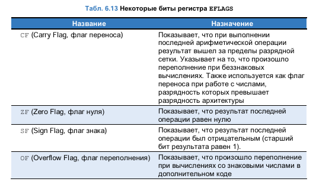

# **Флаги состояния процессора. Их назначение**

Флаги состояния (флаги процессора) — это специальные биты в регистре флагов (FLAGS/RFLAGS/EFLAGS), которые устанавливаются после выполнения арифметических, логических и других операций. Они используются для контроля условий выполнения команд (например, условных переходов `jcc`).

## **1. Основные флаги состояния**

В архитектуре x86/x86-64 ключевые флаги:


| Флаг | Полное название                                                   | Описание                                                                                                                                                                   |
| -------- | ------------------------------------------------------------------------------- | ---------------------------------------------------------------------------------------------------------------------------------------------------------------------------------- |
| **CF**   | Carry Flag (Флаг переноса)                                          | Устанавливается в 1, если произошёл перенос из старшего бита при сложении или заём при вычитании. |
| **ZF**   | Zero Flag (Флаг нуля)                                                   | Устанавливается в`1`, если результат операции равен нулю.                                                                            |
| **SF**   | Sign Flag (Флаг знака)                                                 | Устанавливается в`1`, если результат операции отрицательный (старший бит = 1).                                         |
| **OF**   | Overflow Flag (Флаг переполнения)                               | Устанавливается в`1`, если произошло переполнение знакового числа.                                                          |
| **PF**   | Parity Flag (Флаг чётности)                                         | Устанавливается в`1`, если в младшем байте результата чётное число единиц.                                             |
| **AF**   | Auxiliary Carry Flag (Вспомогательный флаг переноса) | Устанавливается в`1`, если был перенос/заём между 3-м и 4-м битами (для BCD-арифметики).                              |

## **2. Подробное описание флагов**

### **① CF (Carry Flag) — Флаг переноса**

* **Когда устанавливается?**

  * При сложении (`add`), если результат не помещается в регистр (перенос из старшего бита).
  * При вычитании (`sub`), если требуется заём (когда вычитаемое больше уменьшаемого).
  * При сдвигах (`shl`, `shr`), если выходящий бит = `1`.
* **Пример:**
  **asm**

  ```
  mov al, 0xFF
  add al, 1    ; al = 0x00, CF = 1 (перенос)
  ```

### **② ZF (Zero Flag) — Флаг нуля**

* **Когда устанавливается?**

  * Если результат операции равен нулю.
* **Пример:**
  **asm**

  ```
  mov eax, 5
  sub eax, 5    ; eax = 0, ZF = 1
  ```

### **③ SF (Sign Flag) — Флаг знака**

* **Когда устанавливается?**

  * Если старший бит результата = `1` (число отрицательное в дополнительном коде).
* **Пример:**
  **asm**

  ```
  mov eax, 5
  sub eax, 10   ; eax = -5 (0xFFFFFFFB), SF = 1
  ```

### **④ OF (Overflow Flag) — Флаг переполнения**

* **Когда устанавливается?**

  * Если результат знаковой операции не помещается в разрядную сетку (например, сложение двух положительных чисел дало отрицательное).
* **Пример:**
  **asm**

  ```
  mov al, 127   ; 127 (0x7F)
  add al, 1     ; al = -128 (0x80), OF = 1 (переполнение знакового числа)
  ```

### **⑤ PF (Parity Flag) — Флаг чётности**

* **Когда устанавливается?**

  * Если в младшем байте результата чётное число единиц.
* **Пример:**
  **asm**

  ```
  mov al, 0b00101100  ; 3 единицы (нечётное), PF = 0
  ```

### **⑥ AF (Auxiliary Carry Flag) — Вспомогательный флаг переноса**

* **Когда устанавливается?**

  * При операциях с BCD-числами (двоично-десятичный код).
  * Если перенос/заём между 3-м и 4-м битами.
* **Пример:**
  **asm**

  ```
  mov al, 0x0F
  add al, 1    ; al = 0x10, AF = 1 (перенос из 3-го в 4-й бит)
  ```



## **3. Как флаги влияют на условные переходы?**

Флаги используются командами условных переходов (`jcc`):


| Команда | Условие               | Проверяемые флаги |
| -------------- | ---------------------------- | --------------------------------- |
| `je`           | `==`                         | `ZF = 1`                          |
| `jne`          | `!=`                         | `ZF = 0`                          |
| `jg`           | `>` (знаковое)       | `ZF = 0` и `SF = OF`             |
| `jl`           | `<` (знаковое)       | `SF != OF`                        |
| `ja`           | `>` (беззнаковое) | `CF = 0` и `ZF = 0`              |
| `jb`           | `<` (беззнаковое) | `CF = 1`                          |

**Пример:**

**asm**

```
cmp eax, ebx
jg greater   ; переход, если eax > ebx (знаковое сравнение)
```

## **4. Какие команды изменяют флаги?**

* **Арифметические:** `add`, `sub`, `inc`, `dec`, `mul`, `div`.
* **Логические:** `and`, `or`, `xor`, `not`, `test`.
* **Сравнение:** `cmp` (аналог `sub`, но без сохранения результата).
* **Сдвиги:** `shl`, `shr`, `sal`, `sar`.

**Пример:**

**asm**

```
mov eax, 10
mov ebx, 20
cmp eax, ebx  ; устанавливает флаги (ZF=0, SF=1, OF=0)
```

## **5. Вывод**

* **Флаги** — это биты, отражающие состояние процессора после операций.
* **Основные флаги:** `CF` (перенос), `ZF` (ноль), `SF` (знак), `OF` (переполнение).
* **Использование:**
  * Условные переходы (`je`, `jg`, `jl`).
  * Арифметические операции (контроль переполнения).
  * Логические операции (проверка чётности, знака).
