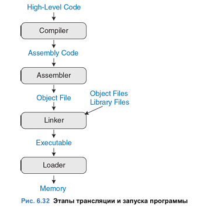
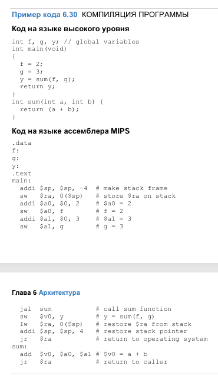
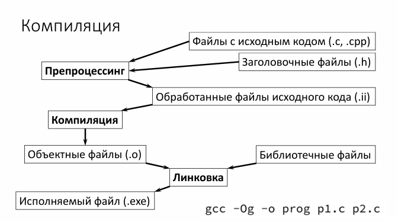
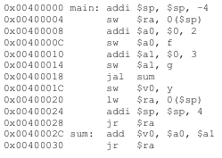
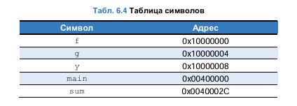
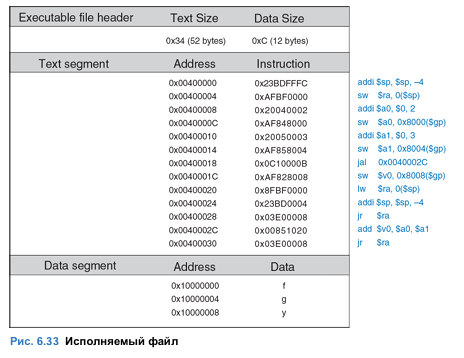
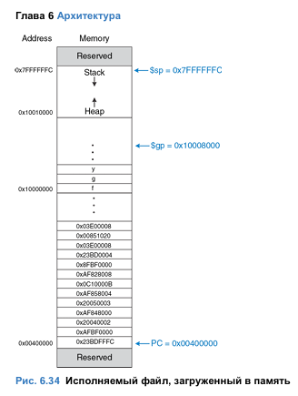

# **Билет. Процесс ассемблирования и компоновки программы. Структура объектного модуля. Таблица символов**

### Трансляция и запуск программы

На Рис. 6.32 показаны этапы, необходимые для трансляции в машинный язык и начала выполнения программы, написанной на языке  высокого уровня. Высокоуровневый код компилируется в код на языке ассемблера, который затем ассемблируется в машинный код и сохраняется в виде объектного файла. Компоновщик, также  называемый редактором связей или линкером (англ.: linker),  объединяет полученный объектный код с объектным кодом библиотек и других файлов, в результате чего получается готовая к исполнению программа. На практике, большинство компиляторных пакетов  выполняют все три шага: компиляцию, ассемблирование и компоновку. Наконец, загрузчик загружает программу в память и запускает ее.  В оставшейся части этого раздела мы более подробно рассмотрим эти  этапы на примере простой программы.





Этап 1: Компиляция

Компилятор транслирует код высокого уровня в код на языке ассемблера. В примере кода 6.30 показана простая программа на языке высокого уровня, содержащая три глобальные переменные и две  функции, а также ассемблерный код, сгенерированный типичным компилятором. Ключевые слова .data и .text – это ассемблерные  директивы, указывающие на начало сегментов данных и кода  соответственно. Для обозначения глобальных переменных f, g и y  используются метки. Места для их хранения будут определены  ассемблером. На данный момент они остаются в коде в виде символов.



Этап 2: Трансляция (Ассемблирование)

Ассемблер транслирует код на языке ассемблера в объектный файл,  содержащий код на машинном языке. Для трансляции кода ассемблер  делает два прохода. Во время первого прохода ассемблер назначает адреса командам и находит все символы, такие как метки и имена  глобальных переменных. После первого прохода ассемблера код  выглядит следующим образом:



Имена и адреса символов хранятся в таблице символов. Таблица символов для нашего примера приведена в Табл. 6.4. Адреса символов  заполняются после первого прохода, когда адреса меток уже известны.  Глобальным переменным присваиваются адреса из сегмента  глобальных данных, начиная с адреса 0x10000000.  Во время второго прохода ассемблер генерирует машинный код.  Адреса глобальных переменных и меток берутся из таблицы символов.

Код на машинном языке и таблица символов сохраняются в объектном  файле.



Этап 3: Компоновка

Большие программы обычно содержат много файлов. Если  программист изменяет один из этих файлов, то перекомпилировать и  заново транслировать все остальные файлы выходит довольно  затратно. Работа компоновщика заключается в том, чтобы объединить все  объектные файлы в один-единственный файл с машинным кодом,  который называется исполняемым файлом. Компоновщик перемещает  данные и команды в объектных файлах так, чтобы они не наслаивались друг на друга. Он использует информацию из таблицы символов для  коррекции адресов перемещаемых глобальных переменных и меток.  В нашем примере только один объектный файл, поэтому никакого  перемещения не требуется. На Рис. 6.33 показан полученный  исполняемый файл. Он состоит из трех секций: заголовка, сегмента  кода и сегмента данных. Заголовок исполняемого файла содержит  информацию о размерах сегмента кода (т.е. об объеме кода) и  размерах сегмента данных (т.е. о количестве глобально объявленных  данных). Все размеры приведены в байтах. Команды в сегмент кода  приведены в том же порядке, в котором они расположены в памяти.  На рисунке рядом с машинным кодом показаны команды в виде,  удобном для восприятия и интерпретации человеком. Исполняемый  файл содержит только машинные команды. Сегмент данных задает  адреса всех глобальных переменных. Доступ к глобальным  переменным осуществляется при помощи базовой адресации  относительно адреса, определяемого глобальным указателем \$gp.  Например, первая команда sw \$a0, 0x8000 (\$gp) присваивает  значение 2 глобальной переменной f, которая размещена в памяти по  адресу 0x10000000. Помните, что смещение 0x8000 – это 16-битное  число со знаком, которое после знакового расширения до 32 битов  прибавляется к базовому адресу, находящемуся в регистре \$gp. Таким образом, \$gp + 0x8000 = 0x10008000 + 0xFFFF8000 = 0x10000000 – это  адрес переменной f.



Этап 4: Загрузка

Операционная система загружает программу, считывая сегмент кода  исполняемого файла с устройства хранения данных (обычно это  жесткий диск) в сегмент кода памяти. Операционная система сначала  присваивает регистру \$gp значение 0x10008000, равное середине  сегмента глобальных данных, затем присваивает регистру \$sp  значение 0x7FFFFFFC, равное верхней границе сегмента динамических  данных, после чего выполняет команду jal 0x00400000 для перехода к  началу программы. На Рис. 6.34 показана карта памяти в начале  выполнения программы.



---

### Ассемблирование

**Ассемблирование** — это процесс преобразования **исходного кода на ассемблере** (текстовый файл с мнемониками) в **машинный код** (бинарный файл, который может выполнять процессор).

#### **Пример ассемблирования**

**Исходный код (`example.asm`):**

**asm**

```
section .text
    global _start
_start:
    mov eax, 1      ; sys_exit
    int 0x80
```

**Команда ассемблирования (NASM):**

**bash**

```
nasm -f elf32 example.asm -o example.o
```

**Результат:**
Объектный файл `example.o` с машинным кодом (в бинарном виде).

### Дизассемблирование

**Дизассемблирование** — это обратный процесс: преобразование **машинного кода** (бинарного файла) в **читаемый ассемблерный код**.

#### **Пример дизассемблирования**

**Команда (objdump):**

**bash**

```
objdump -d example.o
```

## **Структура объектного модуля**

Объектный модуль (или объектный файл) — это промежуточный бинарный файл, создаваемый компилятором или ассемблером, который содержит машинный код, данные и метаданные, необходимые для компоновщика (линкера) для создания исполняемого файла или библиотеки.
Он имеет строгую структуру, зависящую от формата

Объектный файл (например, в формате **ELF** или **COFF**) содержит:

### **① Заголовок (Header)**

* Описывает тип файла (исполняемый, объектный), архитектуру, точки входа.

### **② Секции (Sections)**


| Секция | Содержание                                                                         |
| ------------ | -------------------------------------------------------------------------------------------- |
| `.text`      | Машинный код (инструкции).                                              |
| `.data`      | Инициализированные данные.                                           |
| `.bss`       | Неинициализированные данные (заполняется нулями). |
| `.rodata`    | Данные только для чтения (строки, константы).            |
| `.symtab`    | Таблица символов.                                                             |
| `.rel.text`  | Информация о перемещениях для`.text`.                              |
| `.rel.data`  | Информация о перемещениях для`.data`.                              |

### **③ Таблица символов (Symbol Table)**

Содержит информацию о всех именах (метках, функциях, глобальных переменных) в объектном файле.

Таблица символов — это одна из ключевых структур данных в объектном файле (например, в формате **ELF**, **COFF** или **Mach-O**), которая хранит информацию обо всех именованных сущностях программы: функциях, глобальных переменных, метках и других символах. Она используется компоновщиком (линкером) для разрешения ссылок между модулями и создания итогового исполняемого файла.

### **④ Таблица перемещений (Relocation Table)**

* Указывает, какие адреса нужно исправить при компоновке.
* Например, вызовы внешних функций (`printf`) или переходы между секциями.
