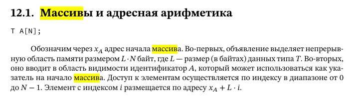

# Указатели. Адресная арифметика. Массивы. Структуры.

Указатели — одна из ключевых концепций языка C, позволяющая работать с памятью напрямую. Они широко используются для:

- динамического выделения памяти,
- передачи данных по ссылке,
- работы с массивами и структурами,
- низкоуровневого программирования (ОС, драйверы).

## Указатели

### **1. Основные понятия**

#### **1.1. Что такое указатель?**

**Указатель** — переменная, хранящая **адрес другой переменной** в памяти.

**Синтаксис:**

```c
int x = 10;
int *ptr = &x;  // ptr хранит адрес x
```

- `&` — оператор взятия адреса.
- `*` — оператор разыменования (доступ к значению по адресу).

#### **1.2. Размер указателя**

Зависит от архитектуры:

- **4 байта** (32-битные системы, x86).
- **8 байт** (64-битные системы, x64).

**Пример:**

```c
printf("%zu", sizeof(int*)); // 4 (x86) или 8 (x64)
```

### **2. Представление указателей на машинном уровне**

#### **2.1. Регистры и память**

- Указатели хранятся в **регистрах** (например, `eax`, `ebx`) или **оперативной памяти**.
- Для работы с ними процессор использует **адресные инструкции**.

#### **2.2. Пример на ассемблере (x86)**

**Исходный код на C:**

```c
int x = 10;
int *ptr = &x;
*ptr = 20;  // меняем значение x через указатель
```

**Ассемблерный код:**

```asm
section .data
x dd 10          ; int x = 10 (4 байта)

section .text
mov eax, x       ; eax = адрес x (аналог &x)
mov [eax], 20    ; *ptr = 20 (запись по адресу)
```

#### **2.3. Ключевые инструкции**


| Инструкция           | Пример на C | Ассемблер (x86) |
| ------------------------------ | ------------------- | ------------------------ |
| Взятие адреса      | `&x`                | `lea eax, [x]`           |
| Разыменование     | `*ptr`              | `mov ebx, [eax]`         |
| Запись по адресу | `*ptr = 5`          | `mov [eax], 5`           |

## 2. Адресная арифметика

### **1. Инкремент и декремент (`++`, `--`)**

Увеличивает или уменьшает указатель на **размер типа**, на который он указывает.

**Пример:**

**c**

```
int arr[3] = {10, 20, 30};
int *ptr = arr;  // ptr = &arr[0]

ptr++;  // ptr = &arr[1] (сдвиг на sizeof(int) = 4 байта)
printf("%d", *ptr); // 20
```

**Машинный уровень (x86):**

**asm**

```
mov eax, [arr]    ; eax = адрес arr[0]
add eax, 4        ; eax += 4 (переход к arr[1])
```

### **2. Сложение с числом (`ptr + N`)**

Сдвигает указатель на `N * sizeof(тип)` байт.

**Пример:**

**c**

```
int *ptr2 = arr + 2;  // ptr2 = &arr[2]
printf("%d", *ptr2);  // 30
```

**Ассемблер:**

**asm**

```
mov ebx, [arr]
add ebx, 8        ; ebx += 8 (arr[2], так как sizeof(int) = 4)
```

### **3. Вычитание указателей (`ptr1 - ptr2`)**

Возвращает **количество элементов** между указателями (не байтов!).

**Пример:**

**c**

```
int *p1 = &arr[0];
int *p2 = &arr[2];
printf("%ld", p2 - p1); // 2 (элемента)
```

**Машинный уровень:**

**asm**

```
mov eax, p2
sub eax, p1      ; eax = разница в байтах
shr eax, 2       ; делим на sizeof(int) = 4 (>>2)
```

### **4. Сравнение указателей (`<`, `>`, `==`)**

Проверяет относительное положение адресов в памяти.

**Пример:**

**c**

```
if (p1 < p2) {
    printf("p1 находится раньше p2 в памяти");
}
```

### **5. Размер шага в адресной арифметике**

Шаг арифметики зависит от типа указателя:


| Тип указателя | Размер типа | Шаг при`ptr + 1` |
| ------------------------- | --------------------- | ---------------------- |
| `char*`                   | 1 байт            | +1 байт            |
| `int*`                    | 4 байта          | +4 байта          |
| `double*`                 | 8 байт            | +8 байт            |
| `struct X*`               | `sizeof(X)`           | +`sizeof(X)`           |

**Пример:**

**c**

```
double darr[3] = {1.1, 2.2, 3.3};
double *dptr = darr;
dptr++;  // сдвиг на 8 байт
```

## **3. Массивы**

Массивы — это фундаментальная структура данных в C, представляющая собой непрерывную область памяти для хранения элементов одного типа

Элементы массива хранятся **последовательно** в памяти. Например, для `int arr[3] = {1, 2, 3}`:

```
Адрес:  0x1000 0x1004 0x1008
Значение: [1]    [2]    [3]
```

#### Формула доступа к элементу

Доступ к `arr[i]` вычисляется как:

```
Адрес arr[i] = Базовый адрес + (i × Размер типа)
```

**Пример на ассемблере (x86):**

**asm**

```
mov eax, [arr + 4*2]  ; Доступ к arr[2] (int = 4 байта)
```

#### **Особенности массивов в C**

* **Фиксированный размер** — размер определяется при объявлении.
* **Неизменяемый тип** — все элементы одного типа.
* **Не проверяются границы** — выход за пределы массива приводит к неопределённому поведению (UB).



### **3.1. Связь массивов и указателей**

- Имя массива — **указатель на первый элемент**.
- `arr[i]` эквивалентно `*(arr + i)`.

**Пример:**

```c
int arr[3] = {10, 20, 30};
printf("%d", *(arr + 1)); // 20 (как arr[1])
```

### **3.2. Представление в памяти**

- Элементы массива хранятся **последовательно**.
- Доступ через **смещение от базового адреса**.

**Машинный уровень:**

```asm
mov ebx, [arr]    ; базовый адрес
mov eax, [ebx + 4] ; arr[1] (4 = sizeof(int))
```

## **4. Структуры**

Структуры (struct) — это составной тип данных, позволяющий объединять переменные разных типов под одним именем. Они являются прототипом "объектов" в процедурном программировании и широко используются для:

* Организации связанных данных
* Создания сложных типов данных
* Работы с бинарными форматами файлов
* Системного программирования

### **4.1. Объявление и доступ**

#### ** Объявление структуры**

**c**

```
struct Point {
    int x;
    int y;
};
```

#### **Создание переменных**

**c**

```
// Вариант 1: Отдельное объявление
struct Point p1;

// Вариант 2: Сразу с объявлением типа
struct Book {
    char title[50];
    float price;
} book1, book2;

// Вариант 3: С инициализацией
struct Point p2 = {10, 20};
```

#### **Доступ к полям**

**c**

```
p1.x = 5;
printf("Координата y: %d", p2.y);
```

### **4.2. Организация памяти**

#### 1. Расположение полей в памяти

Поля располагаются последовательно, но с возможными промежутками (выравнивание):

**c**

```
struct Example {
    char a;    // 1 байт
    // 3 байта padding (выравнивание до 4 байт)
    int b;     // 4 байта
    short c;   // 2 байта
    // 2 байта padding (выравнивание до 8 байт)
};
// Итого: 12 байт вместо ожидаемых 7
```

#### **2. Выравнивание (alignment)**

Процессоры эффективнее работают с данными, выровненными по их натуральному размеру:

* `char` — 1 байт
* `short` — 2 байта
* `int` — 4 байта
* `double` — 8 байт

**Правила:**

1. Структура выравнивается по наибольшему полю
2. Каждое поле располагается по адресу, кратному своему размеру

#### **3. Управление выравниванием**

**c**

```
#pragma pack(1)  // Отключить выравнивание
struct TightPacked {
    int a;
    char b;
};  // Размер 5 байт вместо 8
#pragma pack()   // Вернуть стандартное выравнивание
```

### **4.3. Доступ к полям на ассемблере**

```asm
mov eax, [ebp - 8]   ; p1.x (смещение зависит от структуры)
mov ebx, [ebp - 4]   ; p1.y
```

### **4.4. Указатели на структуры**

```c
struct Point *ptr = &p1;
ptr->x = 30;  // эквивалентно (*ptr).x
```

**Машинный код:**

```asm
mov ecx, [ptr]       ; адрес структуры
mov [ecx], 30        ; ptr->x = 30
```

## **5. Вывод**


| Концепция                        | Описание                                                                   | Машинное представление                  |
| ----------------------------------------- | ---------------------------------------------------------------------------------- | ------------------------------------------------------------ |
| **Указатели**                    | Хранят адреса переменных.                                    | `mov eax, [адрес]`                                      |
| **Адресная арифметика** | Шаг зависит от типа (`int* +1` → +4 байта).                  | `add eax, sizeof(тип)`                                    |
| **Массивы**                        | Последовательное хранение,`arr[i]` ↔ `*(arr + i)`.        | `mov ebx, [arr + i*4]`                                       |
| **Структуры**                    | Поля хранятся подряд, возможно выравнивание. | Доступ через смещение (`[ebp + offset]`). |

**Ключевые моменты:**

- Указатели и массивы тесно связаны.
- Адресная арифметика учитывает размер типа.
- Структуры могут содержать "дыры" из-за выравнивания.
- Доступ к элементам массивов и структур оптимизируется через смещения.

Это знание помогает писать **эффективный** и **низкоуровневый** код на C.
