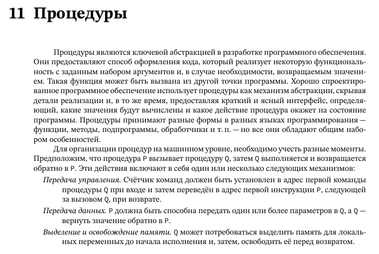
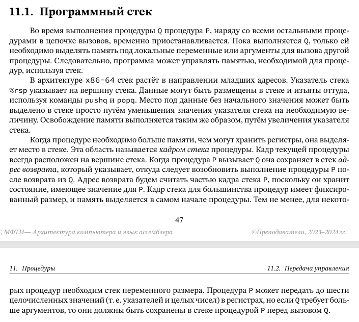

## **1. Процедуры (функции) на машинном уровне**





### **1.1. Основные понятия**

* **Процедура** — логически обособленный блок кода с:
  * Входными параметрами
  * Возвращаемым значением
  * Локальными переменными
  * Адресом возврата
* Стек вызовов (Call Stack):
  * LIFO-структура (Last In, First Out)
  * Хранит:
    * Адреса возврата
    * Параметры функций
    * Локальные переменные
    * Состояние регистров

## **2. Соглашение о вызовах в Linux (x86-64, System V ABI)**

#### **Общие положения**

Соглашение о вызовах (Calling Convention) — это набор правил, определяющих:

* Как передаются параметры в функции
* Как возвращаются результаты
* Какие регистры сохраняются/восстанавливаются
* Как распределяется стек

В Linux для архитектуры x86-64 используется **System V AMD64 ABI**.

### **2.1. Передача параметров**

Первые 6 параметров передаются через регистры:


| Параметр | Регистр | Назначение                           |
| ---------------- | -------------- | ---------------------------------------------- |
| 1                | `rdi`          | Целочисленные, указатели |
| 2                | `rsi`          | Целочисленные, указатели |
| 3                | `rdx`          | Целочисленные, указатели |
| 4                | `rcx`          | Целочисленные, указатели |
| 5                | `r8`           | Целочисленные, указатели |
| 6                | `r9`           | Целочисленные, указатели |

**Пример передачи параметров**:

**c**

```
void func(int a, int b, int c, int d, int e, int f, int g);
// a → rdi, b → rsi, c → rdx, d → rcx, e → r8, f → r9, g → стек
```

#### **Дополнительные параметры**

Параметры с 7-го и далее передаются через **стек** (справа налево):

**c**

```
void func(int a, int b, int c, int d, int e, int f, int g, int h);
// g → [rsp+8], h → [rsp+16] при вызове
```

#### **Плавающая точка**

Параметры типа `float`/`double` передаются через регистры `xmm0`-`xmm7`:

**c**

```
double func(double a, double b);
// a → xmm0, b → xmm1
```

### **2.2. Возвращаемое значение**


| Тип возврата           | Регистр                                     |
| --------------------------------- | -------------------------------------------------- |
| Целочисленные        | `rax`                                              |
| Указатели                | `rax`                                              |
| `float`/`double`                  | `xmm0`                                             |
| Большие структуры | Через скрытый параметр (`rdi`) |

**Пример**:

**c**

```
int sum(int a, int b) {
    return a + b;  // Результат в eax
}
```

### **2.3. Сохранение регистров**

#### **Caller-saved (вызывающая сторона сохраняет)**

Эти регистры могут быть изменены функцией:

* `rax` — возвращаемое значение
* `rcx`, `rdx`, `rsi`, `rdi` — параметры
* `r8-r11` — временные регистры

**Обязанность**: Если значение нужно сохранить — вызывающая функция должна сохранить его перед `call`.

#### **Callee-saved (вызываемая сторона сохраняет)**

Эти регистры должны быть восстановлены перед возвратом:

* `rbx`, `rbp`, `rsp` — базовые регистры
* `r12-r15` — дополнительные регистры

**Обязанность**: Если функция их использует — должна сохранить (обычно в прологе) и восстановить (в эпилоге).

### **3.1 Управление стеком**

#### **Выравнивание стека**

* Перед `call` стек должен быть **выровнен по 16 байтам**.
* После `push` (8 байт) часто требуется дополнительное выравнивание.

**Правило**: `rsp % 16 == 0` перед вызовом функции.

#### **Красная зона (Red Zone)**

* Область **128 байт ниже `rsp`**, которую можно использовать без изменения `rsp`.
* Доступна только в leaf-функциях (которые не вызывают другие функции).
* Перед `call` стек должен быть выровнен по 16 байтам.
* После `push` (8 байт) требуется дополнительное выравнивание.

### **4. Пример полного вызова функции**

**Исходный код на C**:

**c**

```
long func(int a, int b, long c, int d, int e, int f, int g, int h) {
    return a + b + c + d + e + f + g + h;
}
```

Ассемблер (x86-64):

**asm**

```
func:
    push rbp
    mov rbp, rsp
  
    ; Доступ к параметрам:
    ; a (edi), b (esi), c (rdx), d (ecx), e (r8d), f (r9d)
    ; g → [rbp+16], h → [rbp+24]
  
    movsxd rax, edi     ; a
    add rax, rsi        ; +b
    add rax, rdx        ; +c
    add rax, rcx        ; +d
    add rax, r8         ; +e
    add rax, r9         ; +f
    add rax, [rbp+16]   ; +g
    add rax, [rbp+24]   ; +h
  
    pop rbp
    ret
```

## **3. Рекурсия на машинном уровне**

Рекурсия — это процесс, при котором функция вызывает саму себя (прямая рекурсия) или вызывает другую функцию, которая в итоге вызывает исходную (косвенная рекурсия). Это мощный инструмент, который особенно полезен для задач, которые можно разбить на более мелкие подзадачи того же типа.

### **3.1. Компоненты рекурсивной функции**

Каждая рекурсивная функция должна содержать:

1. **Базовый случай (терминальное условие)** — условие выхода из рекурсии.
2. **Рекурсивный случай** — вызов функции с изменёнными параметрами.

**Пример (факториал):**

**c**

```
int factorial(int n) {
    // Базовый случай
    if (n <= 1) return 1;
  
    // Рекурсивный случай
    return n * factorial(n - 1);
}
```

### **3.2. Принцип работы**

* Каждый рекурсивный вызов создаёт **новый экземпляр функции** в стеке вызовов.
* При достижении базового случая начинается **"свёртывание"** (возврат значений).

### **3.3. Представление рекурсии на машинном уровне**

### **а) Стек вызовов**

Каждый вызов функции сохраняет в стеке:

* Адрес возврата
* Локальные переменные
* Параметры функции

**Структура стека для `factorial(3)`**:

```
| factorial(1) | <- вершина стека (базовый случай)
| factorial(2) |
| factorial(3) |
| main()       |
```

### **б) Ассемблерный код (x86-64)**

**asm**

```
factorial:
    push rbp            ; Пролог
    mov rbp, rsp
  
    cmp edi, 1          ; n <= 1?
    jg .Lrecursive
    mov eax, 1          ; Базовый случай: return 1
    jmp .Lreturn
  
.Lrecursive:
    mov eax, edi        ; eax = n
    sub edi, 1          ; n - 1
    call factorial      ; Рекурсивный вызов
    imul eax, edi       ; n * factorial(n-1)
  
.Lreturn:
    pop rbp             ; Эпилог
    ret
```

### **3.4. Опасности рекурсии**

### **а) Переполнение стека**

* Происходит при слишком большой глубине рекурсии.
* Размер стека по умолчанию в Linux — 8 МБ.

**Пример опасного кода:**

**c**

```
void infinite_recursion() {
    infinite_recursion();  // Бесконечная рекурсия
}
```

### **б) Неэффективность**

* Накладные расходы на вызов функции.
* Избыточные вычисления (если нет мемоизации).

---

### **3.5. Отличия от Windows x64 ABI**


| Характеристика              | System V ABI (Linux)                   | Windows x64 ABI                     |
| ----------------------------------------- | -------------------------------------- | ----------------------------------- |
| **Регистры параметров** | `rdi`, `rsi`, `rdx`, `rcx`, `r8`, `r9` | `rcx`, `rdx`, `r8`, `r9`            |
| **Сохранение `rsp`**            | Вызываемая сторона    | Вызывающая сторона |
| **Красная зона**               | Да (128 байт)                    | Нет                              |


### **3.6. Практические советы**

1. **Для оптимизации**:

   * Старайтесь использовать ≤ 6 параметров.
   * Размещайте часто используемые параметры первыми.
2. **При отладке**:
   **sh**

   ```
   gdb -q ./program
   (gdb) disassemble main  # Просмотр ассемблерного кода
   (gdb) info registers    # Проверка регистров
   ```
3. **Для работы с ассемблером**:

   * Всегда сохраняйте `rbp`, `rsp`, `rbx`, `r12-r15`.
   * Не рассчитывайте на сохранение `rax`, `rcx`, `rdx` и др. временных регистров.
